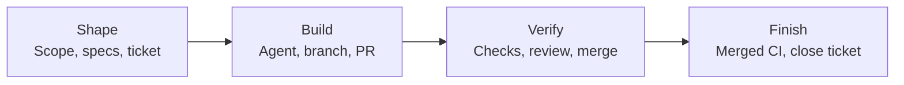

# AI-DLC

**Portable development setup and workflows for people and coding agents.**

AI-DLC brings project setup, agent guidance, specifications, tickets, documentation,
and verification into one repository-owned workflow. Work in Claude Code or Codex,
keep your preferred tools, and carry the same configuration across machines.
You and your agent do the development; AI-DLC prepares the environment and checks
the evidence needed to finish the work.

## Main features

- **Repeatable setup.** Versioned profiles select runtimes, tools, and personal
  agent settings. Each machine keeps its own paths and account bindings.
- **Project scaffolding and updates.** Start or adopt a generic, Python, Node, or
  Rust project. Copier templates provide shared instructions, documentation,
  setup commands, and checks, with previews for adoption and updates.
- **Shared agent guidance.** Render project instructions, skills, hooks, and MCP
  configuration for supported clients. Subscribe to pinned team repositories,
  filter by role or tag, and import supported Tencent teamai layouts.
- **Tickets connected to delivery.** Bind reviewed scope and specifications to a
  ticket, branch, and PR. Completion verifies the merged revision and its CI
  receipts before closing the ticket.
- **Repository docs and private knowledge.** Search project documents, review
  documentation impact, and check ownership and links. Connect canonical project
  docs to an existing Obsidian vault while keeping personal notes separate.
- **Engagement and design workflows.** Scaffold seven-stage forward-deployed
  engineering (FDE) engagement docs with local stage checks. Optional frontend tooling captures Playwright evidence
  for design review.

## How the tools fit together



| Tool | Responsibility |
| --- | --- |
| **AI-DLC CLI + local MCP server** | Setup, configuration rendering, work records, document tools, and completion gates. MCP exposes selected services to agents; machine mutations stay in the CLI. |
| **Claude Code / Codex** | Interactive development using shared instructions and skills for discovery, PRDs, specifications, and handoffs. |
| **uv + mise** | Python environments and dependencies, pinned runtimes, and delegated tool installation. |
| **Copier** | Project templates, recorded template versions, and staged updates. |
| **OpenSpec** | Formal requirements, scenarios, and archived changes when the work needs a specification. |
| **GitHub Issues + Projects / GitHub Actions** | Ticket identity and planning, PR review and merge, and CI evidence. |
| **Obsidian** | Private continuity notes and navigation to canonical repository documents. |

Provider roles are configurable. GitHub Issues + Projects is the recommended
tracker with recorded live evidence; Linear is also supported. Jira Cloud and
Plane adapters are available, with live workflow qualification still pending.
For agent access, register `ai-dlc mcp serve --root /absolute/path/to/project`
as a stdio MCP server in your client. See the [tool map](docs/workflows/tool-map.md)
for available commands, MCP tools, and skills.

## Get started

Native Windows consumer installation is unsupported in this revision. The native
storage core has source-level evidence, but the installer, PowerShell bootstrap,
desktop clients, and end-to-end onboarding remain open in
[#172](https://github.com/Sean-Koval/ai-dlc/issues/172) and
[#53](https://github.com/Sean-Koval/ai-dlc/issues/53). These instructions are for
supported macOS and Linux hosts with a POSIX shell; they do not prescribe WSL,
containers, or translated shell commands as a Windows route.

### Install AI-DLC for a work project

The published [v0.4.0](https://github.com/Sean-Koval/ai-dlc/releases/tag/v0.4.0)
predates `project onboard`, even though the source package version has not changed.
To use the onboarding planner, install a team-reviewed commit or ref from a source
checkout:

```sh
git clone https://github.com/Sean-Koval/ai-dlc.git
cd ai-dlc
git checkout REVIEWED_COMMIT_OR_REF
sh scripts/bootstrap.sh --source
```

Bootstrap needs a POSIX shell, curl, CA certificates, tar, and standard platform
utilities. It installs pinned uv, Python, and mise, prepares this checkout, and
prints the directories to add to `PATH`; no preinstalled Python or Node is needed.
When the global alias belongs to another checkout, use the exact checkout-specific
executable printed by bootstrap for every command below. The version string alone
does not prove that another installation includes this command.

Choose the work repository and client explicitly. For a fresh or unconfigured
repository, plan with the language-neutral preset and no provider, account,
tracker, vault, or machine inheritance:

```sh
AI_DLC=/absolute/path/printed/by/bootstrap/ai-dlc
WORK_ROOT=/absolute/path/to/work-repository
"$AI_DLC" project onboard --root "$WORK_ROOT" --preset generic --agent-client codex
```

The schema-1 JSON is a read-only plan. Exit 0 means its actions are actionable;
it does not mean setup, rendering, readiness, client recognition, authentication,
or target checks completed. Review the exact `argv`, effects, dependencies, and
`requires_review` fields before running an action. `project onboard` does not
fetch, stage, write, or execute. The existing enrollment preview may populate an
inactive local cache, and adoption preview may use a temporary stage; their apply
operations remain separate reviewed commands.

A fresh target's plan recommends the existing adoption service with only the
selected client capability:

```sh
"$AI_DLC" project adopt --root "$WORK_ROOT" --preset generic \
  --capability agent-client --agent-client codex
# Inspect the preview, then repeat that exact command with --apply.
```

Use `python`, `node`, or `rust` only when that preset is an explicit target choice.
Preserve the repository's existing checks and add at least one required check for
its own acceptance behavior; the generic management checks do not establish that
behavior. Then rerun onboarding and follow the available operations in order:

```sh
"$AI_DLC" project onboard --root "$WORK_ROOT" --preset generic --agent-client codex
"$AI_DLC" project setup --root "$WORK_ROOT"
"$AI_DLC" agents render --root "$WORK_ROOT"
# Review the render preview, then repeat with --apply.
"$AI_DLC" project readiness --root "$WORK_ROOT"
git -C "$WORK_ROOT" add .
git -C "$WORK_ROOT" commit -m "chore: adopt ai-dlc"
"$AI_DLC" project check --root "$WORK_ROOT" --required
```

These are target-project checks. Their names do not by themselves prove behavioral
quality, so review what each command exercises. Source-generated projects do not
contain a published release manifest; use the reviewed source-installed executable
for setup and checks rather than treating their release-mode bootstrap as available.
Checks bind receipts to the target repository's `HEAD`.

An already configured repository can run `project onboard --root "$WORK_ROOT"`
without repeating its client selection. Its `ai-dlc.toml` remains authoritative;
conflicting CLI client or preset choices return a blocked plan. Enrollment is
optional for a self-contained project. Select it only when the user actually needs
a portable profile and machine binding, supplying all four values together:

```sh
"$AI_DLC" project onboard --root "$WORK_ROOT" \
  --source REVIEWED_PROFILE_SOURCE --ref REVIEWED_REF \
  --profile-id PROFILE --machine-id MACHINE
```

See [work-computer setup](docs/workflows/work-computer-setup.md) for the full route
and [machine enrollment](docs/runbooks/machine-enrollment.md) for its separate
preview/apply boundary.

### Contribute to the AI-DLC engine

Engine contributors use the source checkout itself as their project. After source
bootstrap, use the checkout-specific executable printed by bootstrap and run the
repository's full required checks:

```sh
AI_DLC=/absolute/path/printed/by/bootstrap/ai-dlc
"$AI_DLC" project check --required
"$AI_DLC" doctor
```

Do not use the engine checkout as the consumer work root or copy its tracker,
vault, provider, or client choices into another project.

### Create a new project directly

Direct creation remains available when that is the reviewed choice:

```sh
"$AI_DLC" project init my-project --preset python --agent-client codex
cd my-project
git init
"$AI_DLC" project setup --root .
git add .
git commit -m "chore: initialize project"
"$AI_DLC" project check --root . --required
```

During edits, run only the named commands relevant to the change:

```sh
ai-dlc project check --check generated
# Repeat --check to select more configured commands, in the requested order.
ai-dlc project check --check generated --check work-records
```

A successful focused run is local feedback. It cannot replace missing required
outcomes in completion evidence. After integrating the target branch, run
`ai-dlc project check --required` before merge. Teams own the commands and required
IDs in `ai-dlc.toml`; keep their existing test tools and add behavioral acceptance
checks. New Python starters include a standard-library test of their initial
output as well as a syntax check; extend those tests as the application grows.

For an adopted repository, use its existing Git history; run setup and review and
commit the adoption and setup changes before checking. Choose `generic`, `python`,
`node`, or `rust`; optional capabilities include `backend` contract checks and
`frontend` browser smoke tests.

Projects created with the released engine carry its release manifest for their
own bootstrap and CI. Source-generated projects need a published
`bootstrap/release.sh` before release-mode bootstrap; see the
[release guide](docs/runbooks/release-publication.md#install-from-a-release).

### Connect tools and configure the project

The generated `ai-dlc.toml` owns shared policy. For example, these sections select
providers and the repository whose merge/CI evidence must be checked:

```toml
[roles]
specs = "openspec"
tracker = "github-issues"
knowledge = "obsidian"
scm = "github"
deploy = "none"
agent-client = ["claude-code", "codex"]

[scm]
repository = "your-org/your-project"
workflow = "verify.yml"
target_branch = "main"
```

Authenticate the GitHub CLI with access to your repository and Project. Then
preview the connection and apply its saved choices from the project root:

```sh
ai-dlc provider connect github-issues --plan-file .ai-dlc/local/github-project.json
ai-dlc provider connect github-issues --plan-file .ai-dlc/local/github-project.json --apply
ai-dlc agents render --apply
ai-dlc project readiness
```

Connection apply can create or reuse a GitHub Project; inspect the preview first.
Readiness checks local requirements; `doctor` also inspects configured provider
health. See [GitHub setup](docs/github-ticket-setup.md) for existing Projects,
custom statuses, and issues-only mode.

| Configuration | Where it belongs |
| --- | --- |
| Shared providers, setup, checks, gates, agent guidance | Project `ai-dlc.toml`, `.mise.toml`, and repository files |
| Portable tools, personal agent preferences, team subscriptions | Private `ai-dlc-profile.toml` repository |
| Local paths, account selections, credential environment-variable names | Machine binding; use `--machine` where supported |
| Secret values | Password manager, keychain, or injected process environment; never Git |

### Carry preferences and team guidance across machines

Enroll a private profile repository at a reviewed tag or advertised Git ref.
Use the same revision on another machine with its own machine ID:

```sh
ai-dlc machine enroll SOURCE --profile-id my-development --machine-id laptop --ref v1
# Review the plan, then repeat with --apply.
ai-dlc machine status
```

Add reviewed team subscriptions to that profile:

```toml
[[sources]]
id = "engineering"
git = "https://example.com/team/practices.git"
ref = "main"
tags = ["review"]
layout = "ai-dlc" # Use "teamai" for the supported teamai reader.
```

Enrollment locks exact source commits and content digests. `ai-dlc machine sync`
previews newer revisions; `ai-dlc machine sync --apply` activates them. Render the
updated guidance into a project with `ai-dlc agents render --apply --root PATH`.
AI-DLC preserves unrelated client settings and refuses collisions or edits to
owned outputs. See [machine enrollment](docs/runbooks/machine-enrollment.md) for
profile setup, role/tag selection, personal MCP servers, and source restrictions.

## Example workflows

### Take a ticket through delivery

With tracker and SCM connections configured, draft work from an existing issue:

```sh
ai-dlc work new improve-setup --from-issue 42
```

Review `.ai-dlc/work/improve-setup.toml`: set scope and acceptance criteria,
decide whether a specification is required, link it when needed, and set
`reviewed = true`. Then:

```sh
ai-dlc work publish improve-setup
ai-dlc work start improve-setup
# Implement, commit, and update the affected documentation.
ai-dlc project check --required
# If this work requires OpenSpec, finalize it with work archive before review.
# Push the bound branch before opening its PR.
ai-dlc work pr improve-setup
# Push the work-record link commit created by work pr, then review and merge.
```

From a checkout at the merge commit, after CI succeeds, run
`ai-dlc work finish improve-setup`. This validates the required specification,
PR merge, and exact merged-revision CI evidence, plus configured deployment gates.
`work status` is a local inspection, not a fresh tracker read.

### Keep project documents useful

```sh
ai-dlc docs init                  # Preview missing navigation.
ai-dlc docs check                 # Inspect ownership, coverage, and links.
ai-dlc docs search "authentication"
ai-dlc docs review --base origin/main
```

Use reviewed dispositions and `ai-dlc docs gate` to keep documentation current
with a change. Project-document access covers repository files; private vault
access uses separate knowledge tools. The [documentation guide](project-templates/project/docs/documentation-guide.md)
covers review, MCP search/read, and optional Obsidian portals and mounts.

### Start an FDE engagement

```sh
ai-dlc fde scaffold customer-delivery --title "Customer delivery" --dry-run
ai-dlc fde scaffold customer-delivery --title "Customer delivery"
ai-dlc fde check customer-delivery
```

This creates a charter and Discover → Frame → Design → Build → Deploy → Enable →
Expand landing pages under `docs/fde_engagements/`. Stage checks require earlier
exit criteria and recorded evidence before downstream activation. See the
[FDE guide](docs/runbooks/fde-documents.md) for configuration and stage metadata.
Confluence publication and synchronization remain unimplemented.

## Go deeper

- [Architecture](docs/architecture.md) — services, configuration layers, and extension points.
- [Development workflows](docs/development-workflow.md) — discovery, greenfield, brownfield, and design review.
- [Machine enrollment](docs/runbooks/machine-enrollment.md) — profiles, team sources, client configuration, and troubleshooting.
- [Verification status](docs/release-verification.md) — platform/provider evidence and remaining qualification gaps, including Antigravity and hosted execution.
- [Documentation map](docs/index.md) — the full guide index.
