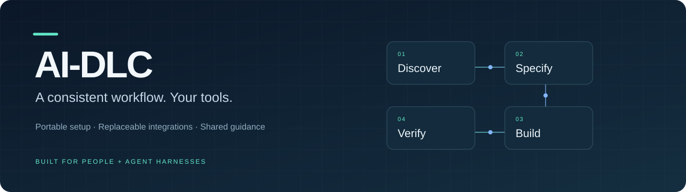

# AI-DLC

**Portable development setup for people and agent harnesses.**

AI-DLC scaffolds repositories, connects replaceable tools, and carries shared
workflow guidance from discovery through verification. Use Claude Code, Codex,
or Antigravity with consistent project structure, reviewed specifications, and
checks that travel with the repository.

- **Set up once, carry it across machines.** Versioned profiles and project files
  describe the environment; credentials and machine-specific settings stay local.
- **Choose your integrations.** GitHub Issues + Projects for personal work, Jira
  Cloud for work, or optional Plane. Provider capabilities keep workflow guidance
  independent of a particular tracker.
- **Keep development organized.** Connect requirements, specifications, tickets,
  implementation, and verified completion through the CLI and local MCP server.
- **Keep knowledge intentional.** Store durable team documentation in the repo and
  personal notes in Obsidian. Selective Confluence integration remains deferred.

See the [product direction](docs/product-direction.md), [delivery roadmap](docs/roadmap.md),
[work-computer setup](docs/workflows/work-computer-setup.md), and
[executor handoff](docs/handoffs/framework-delivery.md). Those pages distinguish
planned capabilities from the implementation available today.

**Install from source today.** The Python CLI, local MCP server, project scaffolding,
tracker adapters, and harness configuration are implemented. Source checks run on
Linux x64/ARM64 and macOS Intel, with separate native Apple silicon observations.
Actual client and provider qualification varies by environment; calibration and
release verification remain incomplete. There is no published v4 bootstrap release.
See [verification status](docs/release-verification.md).

## Prepare this checkout

From a checkout of this repository:

```sh
sh scripts/bootstrap.sh --source
```

The standalone script verifies and installs its pinned uv and mise downloads, prepares a private engine interpreter, installs the checked-out implementation, and prepares the project. It needs a POSIX shell, curl, CA certificates, tar, and standard platform utilities. It prints the two directories to add to your shell's PATH. It does not require preinstalled Python, Node, Rust, mise, or AI-DLC.

After adding those directories:

```sh
ai-dlc project check --required
ai-dlc doctor
ai-dlc setup plan --profile profiles/example/ai-dlc-profile.toml
ai-dlc setup apply --profile profiles/example/ai-dlc-profile.toml
```

Machine setup installs the selected workstation modules. Interactive sign-ins and provider workspace selections remain explicit. Use guided provider connection to discover and select the tracker destination before publishing work. See [GitHub Issues and Projects setup](docs/github-ticket-setup.md). Keep vault paths and account choices in a machine TOML file, and supply it with `--machine` where supported. Credentials are environment references or native tool sign-ins.

## Portable profile and machine enrollment

Keep a personal `ai-dlc-profile.toml` in a separate private Git repository. It
contains portable module choices, logical credential requirements, and optional
agent configuration, but no account selection, path, repository, vault, or
credential value. Enroll a reviewed, pinned Git revision on the first machine,
then enroll that same pinned revision on a second machine with its own machine
ID and binding. Each machine edits its local binding independently.

Preview enrollment can materialize an inactive cache, but does not change the
active enrollment, client configuration, or package state. Repeat the same
command with `--apply` to activate it:

```sh
ai-dlc machine enroll SOURCE --profile-id example-development --machine-id MACHINE_A --ref IMMUTABLE_REF_OR_TAG
ai-dlc machine enroll SOURCE --profile-id example-development --machine-id MACHINE_A --ref IMMUTABLE_REF_OR_TAG --apply
```

The local lock always records the exact resolved commit. Choose one of two
policies: an immutable advertised tag or ref gives cross-machine reproducibility
and makes `ai-dlc machine sync` idempotent; an intentionally movable advertised
branch lets `ai-dlc machine sync` preview a newer candidate and `ai-dlc machine
sync --apply` activate it after validation and reconciliation. To move from one
immutable tag to another, reenroll with the new ref. Enroll a second machine
with the same advertised ref under the selected policy and its own machine ID.

Use `ai-dlc machine status`, `plan`, `apply`, `sync`, and `doctor` to inspect,
preview, reconcile, update, and diagnose that enrollment. Put selected tracker
credentials in a password manager or keychain that injects the
configured environment variable named by that provider; never
put values in AI-DLC Git files or commit `.env` files.

Local CLI and local MCP execution are the current control plane. Hosted or
cloud execution is a later qualification target, not a feature claim. Obsidian
create/attach remains a gap; current knowledge commands act only on an explicitly
selected existing vault. Guided connection supports GitHub Issues and Projects, Jira Cloud, optional Plane,
and Linear. See the [GitHub qualification record](docs/verification/github-ticket-workflows.md) for remaining live gates.

MCP exposes reviewed work operations, read-only doctor inspection, and selected
knowledge operations. Machine enrollment mutations remain CLI-only in this
cycle.

Personal MCP servers declared in the selected profile are previewed by `setup plan` and merged into the supported user-level Codex and Claude configuration during `setup apply`. AI-DLC records only the entries it owns, preserves unrelated settings, and stops on edited or colliding entries. To review or apply only this layer, use `ai-dlc agents render --personal <profile> --check` and then replace `--check` with `--apply`.

## Prepare a project

```sh
ai-dlc project init my-project --preset python --tracker github-issues --apply
ai-dlc project adopt --root /path/to/existing-project --preset generic --tracker github-issues
```

For work repositories, follow [work-computer setup](docs/workflows/work-computer-setup.md)
to select Jira Cloud, private Obsidian storage and Claude Code/Antigravity. Personal
GitHub connection setup proposes a repository-associated Project by default; Plane
is optional. Omitted provider options preserve legacy scaffold defaults.

Adoption previews changes; add `--apply` after reviewing the preview. It stages changes and refuses conflicting destination content. Generic, Python/uv, Node, and Rust presets include durable documentation and shared instructions. Versioned Git template sources support Copier updates; bundled development templates require an explicit versioned source before cross-machine updates.

The project owns `ai-dlc.toml` (setup, checks, gates and providers), `.mise.toml` (runtimes), `.ai-dlc/work/` (reviewed work bindings), and repository documentation. Machine configuration owns local paths. Personal notes remain in your existing Obsidian vault.

## Work cycle

1. Use discovery and specification skills to review scope and acceptance criteria. Record whether a formal specification is required.
2. Prepare `.ai-dlc/work/<id>.toml`; `work publish` creates or reuses the tracker item.
3. `work start` binds a branch. Implement, run `project check --required`, and update durable docs.
4. Finalize required specifications before review and merge.
5. `work finish` checks the merged revision's configured CI evidence and any deployment gate before completing the tracker item. Handoff failures remain separately retryable.

GitHub Issues with Projects planning, Jira Cloud, Plane, Linear, OpenSpec, GitHub SCM, Obsidian, and optional deployment evidence adapters are included. Configure the destination repository, workflow, target branch and provider settings explicitly. Provider changes affect new work; use reviewed rebind mappings for existing work.

## Architecture and customization

- `src/ai_dlc/`: configuration, provisioning, setup/check execution, workflow services, providers, CLI and MCP.
- `profiles/`, `modules/`, `targets/`: preferences, delegated installation recipes, target capabilities.
- `agents/`: shared skills, pinned sources, client capability declarations and owned configuration.
- `project-templates/`, `playbook/`, `contracts/`: Copier presets, development process, generated provider schemas.
- `docs/`: [architecture](docs/architecture.md), [workflow](docs/development-workflow.md), [migration](docs/migration.md), and [implementation record](docs/archive/planning/implementation-v4.md).

Local execution and GitHub Actions use one checks manifest. CI runs this checkout's implementation and publishes a receipt; completion checks verify workflow identity, merged SHA and manifest digests. Client hooks cover documented tool paths only. Repository merge rules must be configured by the repository owner.

The legacy `ai-dlc-cli scaffold --provider gemini` and `--all` interface remains available through Python. Rust source is retained for reference; Rust publishing is retired. See the migration guide for PATH conflicts.

### Keep project documentation organized

Use `ai-dlc project docs-init` to preview an optional documentation map, then add `--apply` to create missing navigation. OpenSpec remains the home for specifications. `ai-dlc project docs-check` reports ownership, review and local-link gaps without editing content. `ai-dlc project link-vault` creates a local Obsidian project note linking to canonical files. See the [documentation workflow](docs/design/project-documentation.md).

Documentation upkeep now includes explicit Git impact review, source-bound
dispositions, bounded semantic-review packets and optional linked Obsidian
workspaces. See the [documentation workflow](project-templates/project/docs/documentation-guide.md)
for setup, company SDK guidance and the limits of automated checks.
