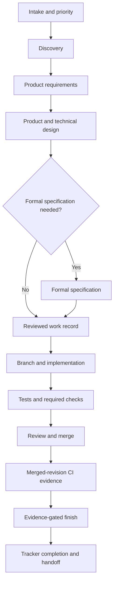

# AI-DLC development workflow

This is the canonical, compact map of the AI-DLC workflow. It describes stable
development stages and their evidence contracts. Tool names are kept in the
[tool map](workflows/tool-map.md) so providers can change without redefining the
lifecycle.

AI-DLC prepares tools, structure, and guidance for the chosen harness. Agents can
invoke installed provider tools directly. The services below own specific
validation and lifecycle boundaries; they do not mediate every development action.
See [product direction](product-direction.md) and the [roadmap](roadmap.md) for
planned capabilities.

Product requirements explain outcomes, specifications define behavior, tickets
organize deliverable slices, and tasks describe implementation steps. Link these
artifacts through stable references. UI/UX evaluation is an optional branch;
other work uses its own appropriate verification methods.

Use the [greenfield guide](workflows/greenfield.md) for a new application and
the [brownfield guide](workflows/brownfield.md) for an existing repository. The
[design-to-implementation guide](workflows/design-to-implementation.md) defines
the handoff between an approved design and code.

## Workflow at a glance



AI-DLC does not host an autonomous orchestrator. The human and agent decide
what work is useful. Skills provide judgment; the CLI validates, stores, links,
reconciles, and gates the resulting work. MCP exposes only its reviewed work,
doctor, and knowledge services.

## Stage contracts

| Stage | Purpose | Durable output | Exit condition |
| --- | --- | --- | --- |
| Intake | Reconcile an idea with current priorities | Tracker item or reviewed candidate | The next investigation is explicit |
| Discovery | Establish users, outcomes, constraints, evidence, and unknowns | Bounded problem statement | The problem is clear enough to define or stop |
| Product requirements | Record rationale, scope, outcomes, risks, and acceptance | Reviewed PRD when the change needs one | Material product questions are resolved or named |
| Design | Define journeys, states, system boundaries, interfaces, and consequential choices | Design document, diagram, and linked decisions | Implementers can act without inventing product behavior |
| Specification decision | Decide whether formal behavior needs a specification | Recorded decision and, when required, provider-owned specification | Required scenarios and acceptance criteria are current |
| Work publication | Bind reviewed scope to durable tracker state | `.ai-dlc/work/<id>.toml` and tracker item | The record is reviewed before external mutation |
| Implementation | Deliver the smallest coherent change on the bound branch | Code, tests, migrations, and updated durable docs | Local required checks pass |
| Review and merge | Evaluate correctness, maintainability, risk, and scope | Reviewed pull request and merged revision | Required review and repository rules pass |
| Verification and finish | Authenticate the merge and its configured evidence | CI receipts and optional deployment evidence | `ai-dlc work finish <work-id>` accepts every configured gate |
| Continuity | Preserve only what the next person or session needs | Handoff, runbook updates, and linked personal notes | Remote state and remaining work are unambiguous |

Each stage consumes reviewed output from the previous stage. Skipping an
artifact is acceptable when the stage explicitly decides it is unnecessary;
silently replacing it with assumptions is not.

## Design to implementation ownership

For both greenfield and brownfield work, skills own discovery, requirements,
design judgment, and the specification decision. The CLI owns reviewed work
records, local checks, machine lifecycle commands, and completion gates. Local
MCP exposes reviewed work operations, read-only doctor inspection, and selected
knowledge operations; machine enrollment mutations are CLI-only in this cycle.
It does not create a second workflow. The design-to-implementation handoff is complete only when the
approved design, any required specification, and the reviewed work record let
implementation proceed without inventing behavior.

## Portable profile and machine enrollment

Keep a personal `ai-dlc-profile.toml` in a separate private Git repository and
pin the revision enrolled on each machine. The profile owns portable modules,
logical credential requirements, and agent preferences; the project repository
owns shared policy and durable docs. Each machine independently owns its
binding, including paths, account selection, and environment-variable names.
Credential values belong only to a password manager, keychain, or process
environment. Generated Codex and Claude client files remain owned by their
client configuration, which AI-DLC updates through its ownership rules.

Use `ai-dlc machine status`, `plan`, `apply`, `sync`, and `doctor` to inspect,
preview, reconcile, update, and diagnose local enrollment. Local CLI and MCP
execution are the current control plane; hosted or cloud execution is a later
qualification target. Obsidian create/attach and provider discovery are
next-cycle gaps, so knowledge remains provider-neutral and is attached only to
an explicitly selected existing store.

Use `ai-dlc project readiness --root PATH` to inspect the selected component
requirements offline. Its JSON separates tool availability, provider configuration,
credential presence, harness guidance, and provider health, with a next action for
each gap. Exit 0 means all required offline checks are ready; missing, blocked, or
unverified required checks return 1. Tools are located on the current environment's
PATH without execution. Credentials are checked only in that environment; secret
files are never loaded. Provider health stays informational and unverified, and
`qualification` is always `not-assessed`.
Missing custom Markdown instructions produce a component-specific guidance gap
and a restoration action while independent checks continue. Manifest digest,
schema, path, and symlink violations still block catalog inspection.

`ai-dlc agents render --apply --root PATH` delivers the project-owned provider/tool
index in `AGENTS.md`, which Claude Code receives through its managed `CLAUDE.md`
import. Packaged instructions are owned copies in `.ai-dlc/providers/`; custom
component instructions remain linked project files. Edited or authored copies
are preserved through the existing conflict rules. A provider selected only in a
personal profile can have a missing-delivery gap: declare the intended shared
provider in `ai-dlc.toml` before rendering. Rendering does not promote private
configuration automatically. Missing component metadata is reported explicitly;
the index does not establish new provider or client support.
Rendering refuses any managed removal that would leave selected instructions
with a dangling link, including deselected skills in either client directory.
Move those instructions to a project-owned path and update the manifest first.

Setup plan/apply with `--root` adds selected project component requirements to
machine provisioning. Global MCP settings continue to use the personal profile
and machine configuration; project server lists remain scoped to the project.

Root and machine doctor retain their enrollment and readiness decisions and add
these offline diagnostics under `project_readiness`. Their existing explicit
provider-health inspection remains separate, as do work finish and release gates.

### Linear connection discovery and sandbox walkthrough

`ai-dlc provider connect linear --root PATH` reads the organization, every team,
and every workflow state visible to the project's configured `token_env`. With no
selection flags it prints that complete discovery and writes nothing. It never
chooses between duplicate team names or multiple `started` states.

For an authorized sandbox read-only walkthrough:

1. Confirm `PATH/ai-dlc.toml` selects the intended Linear credential environment
   variable and inject that variable into the current process. Do not put its value
   in the project, `.ai-dlc/local/`, or the command line.
2. Confirm the credential is restricted to the intended sandbox organization and
   that no apply or selection flags are present.
3. Run `ai-dlc provider connect linear --root PATH` and review the returned
   organization, team IDs, and all workflow-state IDs/types. This procedure makes
   GraphQL reads only; it does not create keys, change accounts, create projects or
   issues, or update the repository.
4. Record live evidence only when the actual authorized sandbox read completed.
   Fixture output proves behavior, not live access or qualification.

To prepare a change, pass all four explicit selection flags:
`--organization`, `--team`, `--in-progress`, and `--closed`. Add `--plan-file
.ai-dlc/local/linear-plan.json` to save the reviewed non-secret JSON plan. Apply
only that saved plan with `--plan-file ... --apply`; apply repeats read-only
discovery, revalidates every saved ID and type, and refuses source, plan, remote
membership, or work-binding drift.

Existing tracker-bound work requires an explicit connection rebind. Run the
selection preview with `--plan-file .ai-dlc/local/linear-plan.json`; the command
saves that non-secret plan but refuses the shared mapping change and lists every
affected work ID. This affected set contains only work whose effective tracker
is Linear and which already has a tracker binding. Create
`.ai-dlc/local/linear-rebind.toml` with one table for every listed ID and an
explicit replacement tracker reference:

```toml
[work-one]
tracker = "SAN-101"

[work-two]
tracker = "SAN-102"
```

Review the saved connection plan, every old and replacement tracker artifact,
and the fresh sandbox scope. Then apply both the mapping and work migration as
one transaction:

```sh
ai-dlc project rebind tracker linear --root PATH --connection-plan .ai-dlc/local/linear-plan.json --mappings .ai-dlc/local/linear-rebind.toml --no-plan
```

This command rejects incomplete mappings, a stale or tampered plan, changed
remote membership, a non-Linear effective adapter, or concurrent project edits
before changing shared files. It computes each replacement binding against the
new configuration. Work pinned to another tracker and work without an existing
Linear tracker binding are not migration inputs and their records remain
byte-for-byte unchanged. The process is explicit: provider onboarding never
invents tracker references or rebinds work automatically.

Preview a private profile enrollment can materialize an inactive cache, but it
does not change active enrollment, client configuration, or package state.
Repeat the same command with `--apply` to activate it:

```sh
ai-dlc machine enroll SOURCE --profile-id example-development --machine-id MACHINE_A --ref IMMUTABLE_REF_OR_TAG
ai-dlc machine enroll SOURCE --profile-id example-development --machine-id MACHINE_A --ref IMMUTABLE_REF_OR_TAG --apply
```

The lock always records the exact resolved commit. An immutable advertised tag
or ref gives cross-machine reproducibility, and `ai-dlc machine sync` is
idempotent for it. An intentionally movable advertised branch instead enables
`ai-dlc machine sync` to preview a candidate and `ai-dlc machine sync --apply`
to activate it after validation and reconciliation. To move from one immutable
tag to another, reenroll with the new ref. Enroll a second machine with the
same advertised ref under the selected policy and a different machine ID; its
local binding remains independent.

## Sources of truth

- The repository owns architecture, product rationale, design context,
  decisions, runbooks, code, and tests.
- The configured specification provider exclusively owns formal behavior
  specifications. Repository design documents link to specifications instead
  of copying them.
- The tracker owns priority and lifecycle status.
- SCM and CI own review, merge identity, and merged-revision evidence.
- Personal knowledge stores continuity, reflection, and private notes. It links
  durable repository material and is not a repository mirror.
- Portable configuration may name required environment variables, such as
  `token_env = "LINEAR_API_KEY"`, but never contains their secret values.
  Machine configuration owns account choices and local paths. `.ai-dlc/local/`
  may hold ignored non-secret control-plane IDs and local metadata. Actual
  credential values stay in an OS keychain, password manager, or secret
  injector and enter only the process environment.

When sources disagree, reconcile their owned facts rather than overwriting one
store with a copy from another.

## Capability boundaries

Initialization and adoption may select any subset of `specs`, `tracker`,
`knowledge`, `scm`, `deploy`, and `agent-client`. Selection controls declared
roles and generated provider assets. The runtime retains compatibility
fallbacks for local OpenSpec and GitHub, but a fallback does not choose an
account, repository, or authorization and must not be mistaken for a configured
role. GitHub uses conventional `verify.yml` and `main` defaults unless they are
overridden. The tracker has no fallback.

- Project setup, checks, architecture, design, decisions, and runbooks remain
  useful without external providers.
- The full publish/start/status/finish lifecycle requires configured tracker and
  SCM roles. Without either role, use the local project lifecycle and manual
  tracking, or configure the missing role before publishing work.
- Without a declared specification role, work may deliberately use the local
  OpenSpec compatibility fallback when its formal artifacts exist. Otherwise,
  work that does not require a specification records `requires_spec = false`
  with a reviewed reason; work that does require one configures the role.
- Knowledge, deployment evidence, and agent clients are optional. Their stages
  are omitted when their roles are not selected; deployment becomes a finish
  gate only when configured.
- Omitting SCM also omits the generated GitHub workflow. Local required checks
  still run, but merged-revision CI completion is unavailable.

## Daily operating loop

1. Reconcile tracker priority, work bindings, branch state, and fresh evidence.
2. Use discovery when the problem or outcome is unclear.
3. Draft and review product requirements when durable rationale is needed.
4. Produce the minimum design that closes product and technical ambiguity.
5. Record whether formal specification is required and make it current when it
   is.
6. Review the work record, then publish and start it through AI-DLC.
7. Implement on the bound branch with acceptance and regression tests.
8. Run `ai-dlc project check --required` before review.
9. Merge through the configured SCM and finish through AI-DLC so current
   specification, merged revision, CI receipts, and deployment evidence are
   checked together.
10. Update durable documentation and leave a concise handoff when continuity is
    needed.

## Completion is evidence-gated

`ai-dlc work finish <work-id>` is the completion boundary for projects with the
required tracker and SCM capabilities. It checks the authenticated merged
revision rather than the local checkout. The generated single-job GitHub
workflow publishes `ai-dlc-receipt`; matrix repositories declare every exact
expected artifact in `scm.receipt_artifacts`. A missing, malformed, dirty,
mismatched, duplicate, or expired receipt blocks completion.

Tracker completion never substitutes for a merge, green CI, a current required
specification, or configured deployment evidence. Failures remain visible and
retryable instead of being converted into success.

## Maintaining this handbook

- Keep lifecycle stages and role names provider-neutral.
- Update [the tool map](workflows/tool-map.md) when a configured provider,
  command, or skill changes.
- Update the greenfield or brownfield guide when initialization or adoption
  behavior changes.
- Update the design handoff when required design evidence changes.
- Store diagrams as Mermaid beside the text they explain. Exported images are
  optional views, never the editable source.
- Change the handbook, project template, relevant skills, and behavior in the
  same pull request when they form one contract.
- Use Git history for evolution; do not maintain a parallel changelog inside
  every guide.
