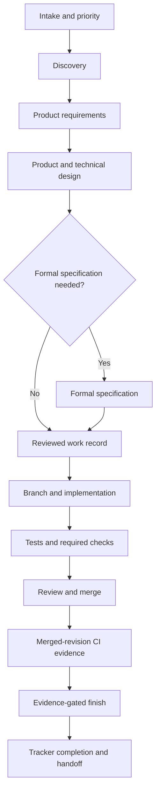

# AI-DLC development workflow

This is the canonical, compact map of the AI-DLC workflow. It describes stable
development stages and their evidence contracts. Tool names are kept in the
[tool map](workflows/tool-map.md) so providers can change without redefining the
lifecycle.

Use the [greenfield guide](workflows/greenfield.md) for a new application and
the [brownfield guide](workflows/brownfield.md) for an existing repository. The
[design-to-implementation guide](workflows/design-to-implementation.md) defines
the handoff between an approved design and code.

## Workflow at a glance

AI-DLC does not host an autonomous orchestrator. The human and agent decide
what work is useful. Skills provide judgment; CLI and MCP services validate,
store, link, reconcile, and gate the resulting work.

## Stage contracts

| Stage | Purpose | Durable output | Exit condition |
| --- | --- | --- | --- |
| Intake | Reconcile an idea with current priorities | Tracker item or reviewed candidate | The next investigation is explicit |
| Discovery | Establish users, outcomes, constraints, evidence, and unknowns | Bounded problem statement | The problem is clear enough to define or stop |
| Product requirements | Record rationale, scope, outcomes, risks, and acceptance | Reviewed PRD when the change needs one | Material product questions are resolved or named |
| Design | Define journeys, states, system boundaries, interfaces, and consequential choices | Design document, diagram, and linked decisions | Implementers can act without inventing product behavior |
| Specification decision | Decide whether formal behavior needs a specification | Recorded decision and, when required, provider-owned specification | Required scenarios and acceptance criteria are current |
| Work publication | Bind reviewed scope to durable tracker state | `.ai-dlc/work/<id>.toml` and tracker item | The record is reviewed before external mutation |
| Implementation | Deliver the smallest coherent change on the bound branch | Code, tests, migrations, and updated durable docs | Local required checks pass |
| Review and merge | Evaluate correctness, maintainability, risk, and scope | Reviewed pull request and merged revision | Required review and repository rules pass |
| Verification and finish | Authenticate the merge and its configured evidence | CI receipts and optional deployment evidence | `ai-dlc work finish <work-id>` accepts every configured gate |
| Continuity | Preserve only what the next person or session needs | Handoff, runbook updates, and linked personal notes | Remote state and remaining work are unambiguous |

Each stage consumes reviewed output from the previous stage. Skipping an
artifact is acceptable when the stage explicitly decides it is unnecessary;
silently replacing it with assumptions is not.

## Sources of truth

- The repository owns architecture, product rationale, design context,
  decisions, runbooks, code, and tests.
- The configured specification provider exclusively owns formal behavior
  specifications. Repository design documents link to specifications instead
  of copying them.
- The tracker owns priority and lifecycle status.
- SCM and CI own review, merge identity, and merged-revision evidence.
- Personal knowledge stores continuity, reflection, and private notes. It links
  durable repository material and is not a repository mirror.
- Portable configuration may name required environment variables, such as
  `token_env = "LINEAR_API_KEY"`, but never contains their secret values.
  Machine configuration, the process environment, and `.ai-dlc/local/` own
  actual credential values, account choices, local paths, caches, and operation
  journals.

When sources disagree, reconcile their owned facts rather than overwriting one
store with a copy from another.

## Capability boundaries

Initialization and adoption may select any subset of `specs`, `tracker`,
`knowledge`, `scm`, `deploy`, and `agent-client`. Selection controls declared
roles and generated provider assets. The runtime retains compatibility
fallbacks for local OpenSpec and GitHub, but a fallback does not choose an
account, repository, or authorization and must not be mistaken for a configured
role. GitHub uses conventional `verify.yml` and `main` defaults unless they are
overridden. The tracker has no fallback.

- Project setup, checks, architecture, design, decisions, and runbooks remain
  useful without external providers.
- The full publish/start/status/finish lifecycle requires configured tracker and
  SCM roles. Without either role, use the local project lifecycle and manual
  tracking, or configure the missing role before publishing work.
- Without a declared specification role, work may deliberately use the local
  OpenSpec compatibility fallback when its formal artifacts exist. Otherwise,
  work that does not require a specification records `requires_spec = false`
  with a reviewed reason; work that does require one configures the role.
- Knowledge, deployment evidence, and agent clients are optional. Their stages
  are omitted when their roles are not selected; deployment becomes a finish
  gate only when configured.
- Omitting SCM also omits the generated GitHub workflow. Local required checks
  still run, but merged-revision CI completion is unavailable.

## Daily operating loop

1. Reconcile tracker priority, work bindings, branch state, and fresh evidence.
2. Use discovery when the problem or outcome is unclear.
3. Draft and review product requirements when durable rationale is needed.
4. Produce the minimum design that closes product and technical ambiguity.
5. Record whether formal specification is required and make it current when it
   is.
6. Review the work record, then publish and start it through AI-DLC.
7. Implement on the bound branch with acceptance and regression tests.
8. Run `ai-dlc project check --required` before review.
9. Merge through the configured SCM and finish through AI-DLC so current
   specification, merged revision, CI receipts, and deployment evidence are
   checked together.
10. Update durable documentation and leave a concise handoff when continuity is
    needed.

## Completion is evidence-gated

`ai-dlc work finish <work-id>` is the completion boundary for projects with the
required tracker and SCM capabilities. It checks the authenticated merged
revision rather than the local checkout. The generated single-job GitHub
workflow publishes `ai-dlc-receipt`; matrix repositories declare every exact
expected artifact in `scm.receipt_artifacts`. A missing, malformed, dirty,
mismatched, duplicate, or expired receipt blocks completion.

Tracker completion never substitutes for a merge, green CI, a current required
specification, or configured deployment evidence. Failures remain visible and
retryable instead of being converted into success.

## Maintaining this handbook

- Keep lifecycle stages and role names provider-neutral.
- Update [the tool map](workflows/tool-map.md) when a configured provider,
  command, or skill changes.
- Update the greenfield or brownfield guide when initialization or adoption
  behavior changes.
- Update the design handoff when required design evidence changes.
- Store diagrams as Mermaid beside the text they explain. Exported images are
  optional views, never the editable source.
- Change the handbook, project template, relevant skills, and behavior in the
  same pull request when they form one contract.
- Use Git history for evolution; do not maintain a parallel changelog inside
  every guide.
