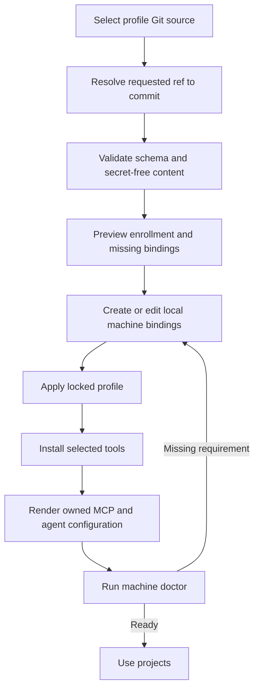

# Portable profile and machine enrollment design

## Status

Proposed design for the approved first AI-DLC dogfooding direction. This design
turns the existing configuration and setup primitives into a reproducible
enrollment flow. It is the first of five independently releasable cycles: profile
enrollment, provider onboarding, agent/workflow portability, daily workflow
usability, and release qualification.

## Problem

AI-DLC can install built-in modules, resolve explicitly supplied configuration
layers, render MCP servers into supported agent clients, prepare projects, and
verify work. It does not yet give a person one portable source that a new machine
can enroll from and later reconcile.

Today a user must remember which profile and machine files to pass, where those
files belong, how to place AI-DLC on `PATH`, and how to repeat the setup on another
machine. Environment variable names can be declared safely, but credential
requirements have no logical identity and no enrollment-time validation. The
result is a collection of sound primitives rather than the intended portable
desired-state framework.

## Outcome

A user can keep a secret-free personal AI-DLC profile in a private or public Git
repository, enroll a supported machine from a pinned revision, bind that machine's
paths and credential environment names, preview the resulting changes, apply them,
and later synchronize deliberately. Two enrolled machines resolve the same tools,
MCP definitions, workflow selections, and provider preferences while retaining
different local bindings and secret values.

## Goals

- Make a versioned profile bundle the portable source for personal tool, MCP,
  workflow, and provider preferences.
- Add a coherent `machine` command group for enrollment, planning, application,
  synchronization, status, and readiness checks.
- Discover enrolled personal and machine configuration automatically while
  preserving explicit command-line overrides.
- Give credentials stable logical names while keeping secret values in external
  credential stores or the process environment.
- Pin the resolved Git commit and content digest used by each machine.
- Preserve plan-before-apply behavior, authored client configuration, and existing
  v4 configuration compatibility.
- Dogfood the resulting lifecycle in the AI-DLC repository.

## Non-goals

- AI-DLC will not store, synchronize, print, or back up secret values.
- This cycle will not configure 1Password, macOS Keychain, or a cloud secret store.
  Those systems inject environment variables through target-specific mechanisms.
- This cycle will not configure Obsidian Sync or another file synchronization
  service.
- This cycle will not create or attach an Obsidian vault. Provider-neutral
  knowledge onboarding is the next cycle and consumes the machine-binding model
  defined here.
- This cycle will not discover Linear teams or statuses or import existing Linear
  work. Tracker onboarding is the next cycle.
- This cycle will not permit arbitrary installation commands from an untrusted
  profile. Profiles may select the verified built-in module catalog. Extensible
  signed module and workflow packages belong to the agent/workflow portability
  cycle.
- This cycle will not create a hosted AI-DLC control plane.
- This cycle will not claim cloud equivalence or release readiness.

## Chosen approach

Use a Git-backed declarative profile bundle plus local enrollment and machine
bindings. This preserves local-first operation, makes changes reviewable, works
offline from the last verified revision, and avoids a new hosted service.

Rejected alternatives:

1. Project-only configuration duplicates personal tools and MCP definitions across
   repositories and mixes personal choices with team-owned policy.
2. Copying generated Codex, Claude, shell, or tool files between machines loses
   ownership and cannot adapt paths or client formats safely.
3. A hosted settings service adds identity, availability, data ownership, and
   security concerns before the local framework is complete.

## Ownership model

| Data | Owner | Portability |
| --- | --- | --- |
| Profile bundle | User-controlled Git repository | Shared across enrolled machines |
| Project configuration | Project repository | Shared with project collaborators |
| Enrollment lock | User-level AI-DLC configuration | Recreated per machine from the same source |
| Machine bindings | User-level AI-DLC configuration | Local to one machine |
| Credential values | External credential provider or process environment | Supplied independently on each target |
| Generated client configuration | Codex or Claude user/project configuration | Re-rendered, never copied |
| Operation and setup journals | User-level AI-DLC state | Local cache, never authoritative remotely |

The initial personal profile should live outside the public AI-DLC product
repository, normally in a private dotfiles or dedicated profile repository. It may
be public when it contains no sensitive account names or organization metadata.

## Profile bundle

The source is a Git repository, optionally narrowed to a relative subdirectory,
containing `ai-dlc-profile.toml`. The first schema reuses current schema-4 personal
fields and adds a stable top-level profile identity:

- selected built-in modules;
- user preferences;
- default provider roles;
- selected shipped workflow skills;
- user-level MCP server definitions containing environment variable names only.

It also introduces logical credential requirements:

```toml
schema = 4
profile_id = "sean-development"

[credentials.linear-sandbox]
description = "Linear API access for the AI-DLC sandbox"
required_by = ["provider.linear-sandbox"]
```

Descriptions and dependency identifiers are portable. A field name associated
with a credential must never accept its value in a profile.

The enrollment lock records:

```toml
schema = 1
profile_id = "sean-development"
source = "git@github.com:example/ai-dlc-profile.git"
requested_ref = "main"
resolved_commit = "<40-character commit>"
content_sha256 = "<bundle digest>"
machine_id = "personal-macbook"
subdirectory = ""
profile_file = "ai-dlc-profile.toml"
```

The lock contains no Git credentials. Native Git authentication owns source
access. A local Git checkout is allowed as the source for development but is
reported as nonportable. The `--profile-id` enrollment argument must match the
identity declared by `ai-dlc-profile.toml`; it is an explicit guard against
enrolling the wrong bundle.

## Machine bindings

Machine bindings extend the existing schema-4 machine layer. A credential binding
maps a logical credential to an environment variable name, never a value:

```toml
schema = 4

[target]
name = "local"

[credentials.linear-sandbox]
source = "environment"
variable = "LINEAR_SANDBOX_TOKEN"

[paths]
vault = "/machine-specific/path/to/vault"
```

Only `source = "environment"` is implemented in this cycle. The schema leaves room
for future target-specific credential resolvers without accepting arbitrary shell
commands. Existing provider `token_env` settings remain supported and are normalized
to the credential resolver internally.

Machine IDs are explicit stable slugs. AI-DLC may suggest a sanitized hostname but
must not silently use hardware identifiers or upload machine information.

## Filesystem layout

Use XDG locations with current macOS/Linux fallbacks:

```text
<config>/ai-dlc/enrollment.toml
<config>/ai-dlc/machines/<machine-id>.toml
<cache>/ai-dlc/profiles/<profile-id>/<resolved-commit>/
<state>/ai-dlc/
```

`enrollment.toml` is the active profile lock. Machine binding files contain paths,
account selections, and credential environment names but no secret values. Cached
profile content is an immutable materialized tree without Git metadata, keyed by
resolved commit. In this first cycle the materialized tree contains only the declared
profile file; unrelated files from a larger dotfiles repository are never copied.
State continues to contain setup and mutation journals.

## Configuration resolution

Configuration resolves in this order:

1. packaged base defaults;
2. enrolled personal profile;
3. project `ai-dlc.toml`;
4. enrolled machine binding.

Higher scopes may override only fields allowed by the existing scope policy. Machine
configuration cannot weaken project checks or change executable provider behavior.
Every resolved value retains provenance.

Explicit `--profile` and `--machine` flags remain available for tests, migrations,
and one-off use. An explicit file replaces the enrolled file in that same scope; it
does not become a new highest-precedence layer. Commands use the enrolled files by
default when those flags are absent. Environment variables may point to alternate
non-secret configuration files, but they do not contain inline configuration or
credentials.

## Command interface

Add a `machine` command group:

```text
ai-dlc machine enroll <git-source> --profile-id <id> --machine-id <id> [--ref <ref>] [--subdirectory <path>] [--apply]
ai-dlc machine migrate <git-source> --profile-file <path> --profile-id <id> --machine-id <id> [--ref <ref>] [--apply]
ai-dlc machine plan
ai-dlc machine apply
ai-dlc machine sync [--apply]
ai-dlc machine status
ai-dlc machine doctor [--root <project>]
```

`enroll` and `sync` preview by default and require `--apply` to change the active
lock. `machine plan` previews workstation and client changes; `machine apply` is the
explicit mutation paired with that plan. Enrollment performs no package installation
or client rewrite. Its plan shows the source, resolved commit, proposed lock,
required machine bindings, missing credential variables, modules, MCP changes, and
any ownership conflicts.

`sync` fetches the requested ref, resolves it to a commit, verifies the bundle, and
previews the difference from the current lock. With `--apply`, AI-DLC runs the same
reconciler as `machine apply` against the verified candidate, then atomically updates
the active lock only after reconciliation succeeds. The candidate cache may remain
after a failure, but it is inactive and may be reused by a later attempt.

`status` is read-only and reports profile identity, locked revision, cache health,
machine binding, drift, and missing requirements. `doctor` combines machine status,
project readiness, client rendering, native sign-ins, credential presence, and
provider health without printing secret values.

Existing `setup plan`, `setup apply`, `profile show`, and explicit `--machine`
interfaces remain as compatibility entry points. They call the same resolver and
reconciler; documentation moves to the `machine` vocabulary.

## Service boundaries

Implement focused units rather than adding more policy to the CLI module:

- `profile_source`: resolve local/Git sources, pin commits, cache immutable content,
  and compute bundle digests;
- `enrollment`: validate and persist enrollment locks and machine identities;
- `credentials`: resolve logical requirements to environment variable names and
  report presence without exposing values;
- `configuration`: discover enrolled layers and retain provenance;
- `machine`: compose planning, setup, client rendering, and readiness services;
- `cli`: parse arguments and serialize service results only.

The MCP server does not expose enrollment mutations in this cycle. Machine setup is
an explicit operator action. Read-only machine status may be exposed after the CLI
contract stabilizes.

## Enrollment flow



## Synchronization and offline behavior

- An enrolled machine continues using its verified cached commit while offline.
- A failed fetch does not invalidate the active profile.
- A moved branch or tag produces a preview; it never updates the lock implicitly.
- A missing or changed cached file fails integrity validation and requires a refetch.
- Applying a new profile commit is transactional for AI-DLC-owned lock/cache metadata
  and retains existing rollback behavior for generated client configuration.
- Package managers remain responsible for their own partial installation behavior;
  AI-DLC reports the failed step and resumes through the existing setup journal.

## Error and conflict handling

- Reject profile files containing secret-shaped value fields before any write.
- Reject unsupported schema versions, unknown top-level fields, invalid machine IDs,
  ambiguous Git revisions, and profile-ID changes without explicit reenrollment.
- Reject a source revision that cannot be tied to an exact commit.
- Preserve user-edited Codex, Claude, shell, and MCP configuration through current
  ownership checks.
- Preserve the active enrollment when a sync candidate is invalid or application
  fails.
- Report missing credentials by logical ID and environment variable name only.
- Never include environment values in plans, errors, logs, receipts, or journals.
- Treat a locally modified cached profile as corrupt rather than as an authored edit.

## Migration

`profiles/sean.toml` becomes the seed for a separate personal profile repository.
The public repository retains `profiles/base.toml` and a nonpersonal example. The
existing file remains accepted during one compatibility window but is no longer the
recommended source.

`machine migrate` enrolls an existing schema-4 personal file already stored in a Git
source. Its explicit `--profile-file` path is recorded in the compatibility lock so
later syncs remain deterministic. A legacy file may omit `profile_id`; the supplied
ID becomes the guarded lock identity. The command previews the proposed lock and
machine file and requires `--apply` to activate them. It never rewrites the source,
moves credentials, or guesses a vault path. Reenrolling after renaming the source
file to `ai-dlc-profile.toml` completes the migration.
Existing `token_env` declarations continue working while documentation adopts logical
credential IDs.

The first AI-DLC work item uses a documented bootstrap exception: create the branch
and configure the sandbox provider manually, then use AI-DLC publication, checks,
linking, and finish. Once enrollment lands, later cycles must start through the
AI-DLC work service.

## Verification strategy

Tests must establish behavior, not only file generation:

1. Unit tests validate source URLs, refs, locks, bundle digests, machine IDs,
   credential schemas, and secret rejection.
2. Configuration tests prove automatic precedence and provenance while preventing
   machine weakening of project policy.
3. Source tests use temporary Git repositories to prove commit pinning, deliberate
   sync, offline cache use, moved refs, corrupt cache rejection, and failed-fetch
   rollback.
4. Enrollment tests use two isolated home directories with different machine paths
   and credential variable names. Both must resolve identical portable tools, MCP
   definitions, workflow selections, and provider preferences.
5. Integration tests prove plan has no writes, apply is idempotent, authored client
   configuration survives, missing credentials remain redacted, and setup resumes.
6. Compatibility tests retain current explicit profile/machine flags and setup
   commands.
7. Template tests ensure new projects explain enrollment without embedding a personal
   source or secret.
8. The repository's complete required check suite remains green.

## Acceptance criteria

- A fresh supported machine can enroll from an exact Git-backed profile revision
  using one command and a reviewed apply step.
- A second simulated machine obtains the same portable desired state with independent
  paths and credential environment names.
- A machine can operate offline from the last verified cached revision.
- Profile synchronization never changes active state without `--apply`.
- No profile, lock, machine file, generated configuration, output, journal, or test
  fixture contains a credential value.
- Existing authored agent configuration and current explicit CLI interfaces remain
  intact.
- `machine doctor` identifies every missing binding needed for the selected profile
  and project.
- The first dogfood work item is linked to the sandbox tracker, verified by required
  checks, merged through GitHub, and completed through AI-DLC.

## Follow-on cycles

1. Provider onboarding adds provider-neutral connect/discover/test contracts,
   Obsidian create/attach/status, Linear workspace/team/status discovery, and existing
   tracker attachment.
2. Agent and workflow portability adds pinned external module/workflow packages,
   automatic AI-DLC MCP registration, hook activation, and behavioral evaluations.
3. Daily workflow usability adds work initialization/import/review/reconciliation,
   automatic artifact discovery, repository policy verification, and human-readable
   output.
4. Release qualification completes live conformance, clean target walkthroughs,
   cloud equivalence, signed artifacts, installation, upgrade, and rollback evidence.
