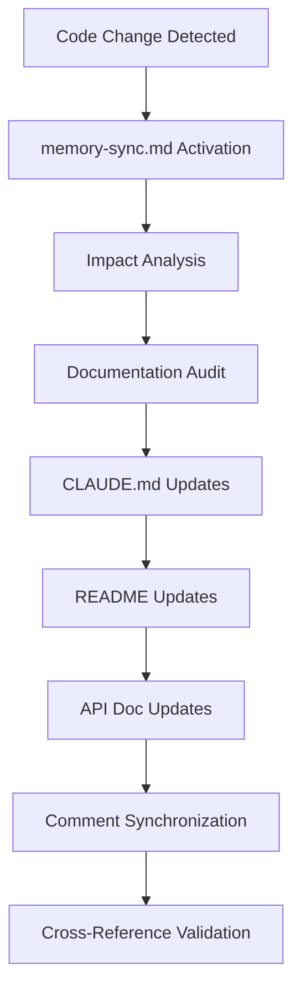
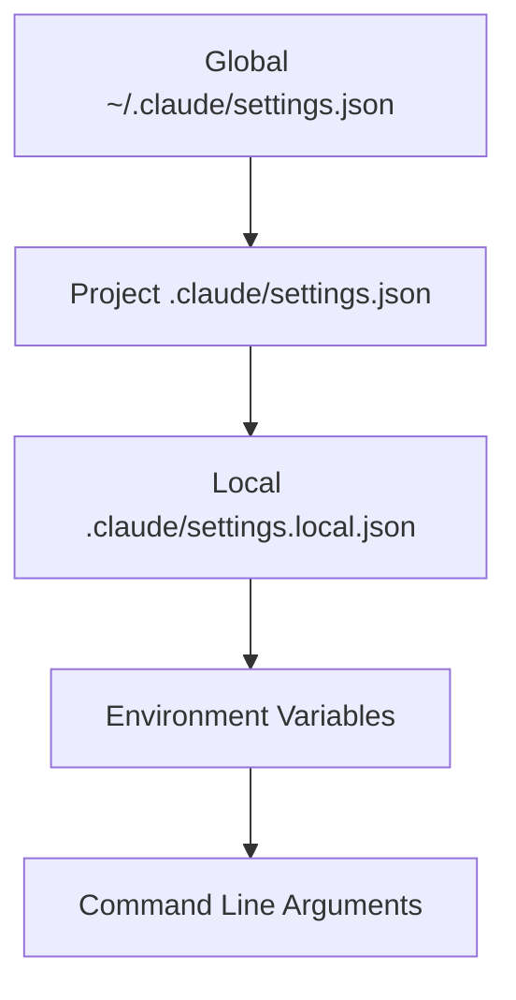
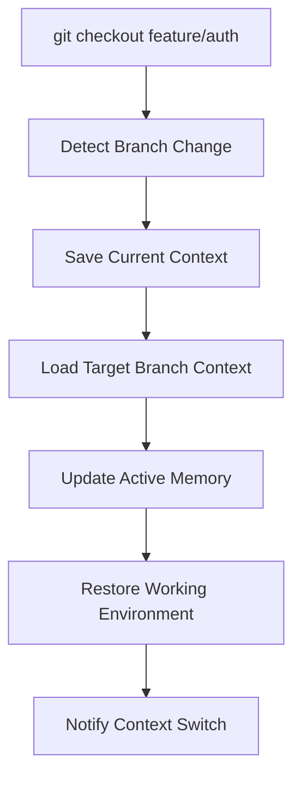
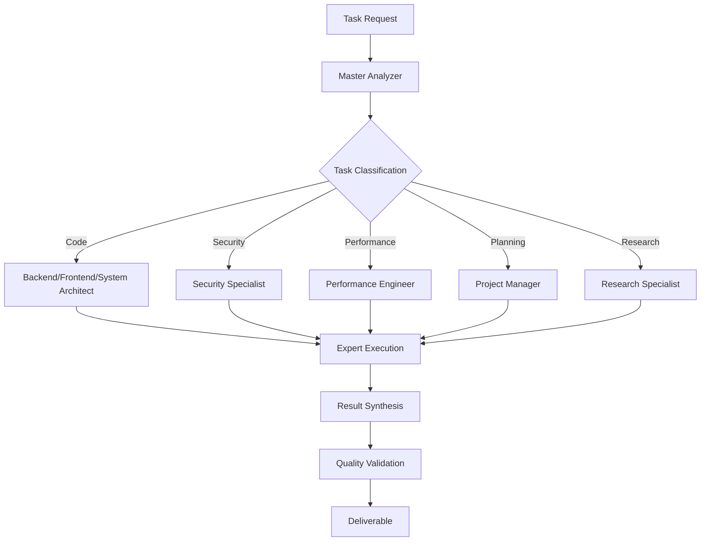

# Repository Command & Workflow Analysis for AI-DLC Templates

## Executive Summary

This document provides detailed workflow analysis for commands and agents from leading Claude Code repositories, focusing on their interactions, problems solved, and implementation patterns for integration into the AI-DLC template system.

---

## 1. **hikarubw/claude-commands** - Smart Development Workflows

### Repository Overview
- **Focus**: Fast, parallel execution with smart automation
- **Philosophy**: Reduce manual developer overhead through intelligent automation
- **Star Count**: ~500 stars
- **Key Strength**: Proven daily-use commands with time-saving focus

### Commands & Workflows

#### **`/user:init` - Smart Project Initialization**

**Problem Solved**: Manual project setup takes 2-4 hours, inconsistent structure across projects

**Workflow Interaction**:
```mermaid
graph TD
    A[/user:init] --> B[Analyze Project Type]
    B --> C[Create Structure]
    C --> D[Setup Git + CI/CD]
    D --> E[Configure Tools]
    E --> F[Generate Docs]
    F --> G[Setup Dev Environment]
    G --> H[Run Initial Tests]
```

**Implementation Details**:
1. **Auto-detection**: Scans for existing files (package.json, Cargo.toml, etc.)
2. **Structure Creation**: Creates directories following best practices
3. **Git Setup**: Initializes repo with appropriate .gitignore
4. **CI/CD Pipeline**: GitHub Actions or GitLab CI setup
5. **Tool Configuration**: ESLint, Prettier, cargo fmt, etc.
6. **Documentation**: README, CONTRIBUTING, CODE_OF_CONDUCT
7. **Testing**: Initial test files and configuration

**Command Interaction Chain**:
```bash
/user:init my-project
↓
# Automatically triggers quality setup
↓
/user:check  # Validates initial setup
↓
/user:plan   # Creates development roadmap
```

**AI-DLC Integration**: Maps to `/dlc:scaffold --template basic --full-setup`

---

#### **`/user:check` - Parallel Quality Assurance**

**Problem Solved**: Quality checks take 30-45 minutes, often skipped due to time pressure

**Workflow Interaction**:
```mermaid
graph TD
    A[/user:check] --> B[Parallel Execution Start]
    B --> C[Linting]
    B --> D[Type Checking]
    B --> E[Security Scan]
    B --> F[Test Coverage]
    B --> G[Performance Check]
    B --> H[Dependency Audit]
    C --> I[Aggregated Report]
    D --> I
    E --> I
    F --> I
    G --> I
    H --> I
```

**Implementation Details**:
1. **Parallel Execution**: All checks run simultaneously using background processes
2. **Language Detection**: Automatically detects tech stack and runs appropriate tools
3. **Aggregated Reporting**: Single consolidated report with actionable insights
4. **Auto-fixing**: Automatically fixes formatting and simple issues
5. **Threshold Configuration**: Customizable pass/fail criteria
6. **CI Integration**: Designed for pre-commit and CI/CD pipeline integration

**Command Variants**:
```bash
/user:check              # Full parallel check
/user:check --fast       # Skip slow checks
/user:check --fix        # Auto-fix issues
/user:check src/         # Target specific directory
```

**Daily Workflow Integration**:
```bash
# Morning routine
/user:check --fast       # Quick health check
↓
# Development cycle
Code changes → /user:check → Fix issues → Commit
↓
# Pre-push
/user:check --full → /user:push
```

**AI-DLC Integration**: Maps to `/dlc:validate --mode comprehensive`

---

#### **`/user:push` - Intelligent Git Workflow**

**Problem Solved**: Git workflows are error-prone, inconsistent commit messages, missed CI failures

**Workflow Interaction**:
```mermaid
graph TD
    A[/user:push] --> B[Analyze Staged Changes]
    B --> C[Generate Smart Commit Message]
    C --> D[Pre-commit Quality Gates]
    D --> E{Quality Pass?}
    E -->|No| F[Fix Issues & Retry]
    E -->|Yes| G[Push to Remote]
    G --> H[Monitor CI Pipeline]
    H --> I[Create/Update PR]
    I --> J[Notify Team]
    F --> D
```

**Implementation Details**:
1. **Smart Commit Messages**: AI analyzes diffs to generate meaningful commit messages
2. **Change Analysis**: Understands what files changed and why
3. **Quality Gates**: Runs `/user:check` before pushing
4. **Conflict Resolution**: Intelligent merge conflict handling
5. **CI Monitoring**: Watches pipeline status and reports failures
6. **PR Management**: Auto-creates PRs for feature branches
7. **Team Notifications**: Slack/email notifications for important events

**Smart Features**:
```bash
# Commit message generation
git add .
/user:push
# → "feat: add user authentication with JWT tokens and session management"

# Branch-aware workflow
/user:push feature/auth
# → Pushes to feature branch, creates PR to main

# Hotfix workflow
/user:push --hotfix
# → Fast-track push with minimal checks
```

**Integration with Other Commands**:
```bash
/user:plan "new feature"     # Plan the work
↓ (implement changes)
/user:check                  # Validate quality
↓
/user:push                   # Smart deployment
↓
# Automatically triggers team notifications
```

**AI-DLC Integration**: Maps to `/dlc:deploy --smart-commit`

---

#### **`/user:plan` - Strategic Development Planning**

**Problem Solved**: Poor planning leads to scope creep, missed dependencies, inefficient implementation

**Workflow Interaction**:
```mermaid
graph TD
    A[/user:plan] --> B[Requirement Analysis]
    B --> C[Critical Thinking Process]
    C --> D[Dependency Mapping]
    D --> E[Risk Assessment]
    E --> F[Implementation Strategy]
    F --> G[Timeline Estimation]
    G --> H[Resource Allocation]
    H --> I[Milestone Creation]
```

**Implementation Details**:
1. **Critical Thinking Framework**: Uses structured analysis methodology
2. **Dependency Detection**: Identifies technical and business dependencies
3. **Risk Analysis**: Proactive risk identification and mitigation planning
4. **Implementation Roadmap**: Step-by-step implementation guide
5. **Time Estimation**: AI-powered effort estimation based on historical data
6. **Resource Planning**: Team capacity and skill requirement analysis

**Planning Modes**:
```bash
/user:plan "feature: user dashboard"
# → Comprehensive feature planning

/user:plan --epic "mobile app redesign"
# → Large initiative breakdown

/user:plan --debug "performance issues"
# → Problem analysis and solution planning

/user:plan --quick "bug fix for login"
# → Rapid tactical planning
```

**Output Structure**:
```markdown
## Feature Plan: User Dashboard

### Requirements Analysis
- [ ] User authentication integration
- [ ] Data visualization components
- [ ] Real-time updates

### Dependencies
- Authentication service (ready)
- Chart.js library (needs upgrade)
- WebSocket implementation (new)

### Implementation Strategy
1. Setup data models (2 hours)
2. Create UI components (8 hours)
3. Integrate WebSocket (4 hours)
4. Testing & polish (4 hours)

### Risks & Mitigations
- Risk: WebSocket complexity
- Mitigation: Use proven library (Socket.io)

### Timeline: 3-4 days
```

**Workflow Integration**:
```bash
/user:plan → Implementation → /user:check → /user:push
```

**AI-DLC Integration**: Maps to `/dlc:plan --detailed --critical-thinking`

---

#### **`/user:handover` - Knowledge Transfer Automation**

**Problem Solved**: Context loss during handoffs, incomplete documentation, knowledge silos

**Workflow Interaction**:
```mermaid
graph TD
    A[/user:handover] --> B[Session Analysis]
    B --> C[Code Changes Summary]
    C --> D[Decision Documentation]
    D --> E[Next Steps Planning]
    E --> F[Team Communication]
    F --> G[Handover Document Creation]
```

**Implementation Details**:
1. **Session Reconstruction**: Analyzes entire coding session for context
2. **Change Documentation**: Summarizes what was built and why
3. **Decision Rationale**: Documents architectural and implementation decisions
4. **Next Steps**: Clear actionable items for continuation
5. **Team Communication**: Automatic notifications with handover summary
6. **Knowledge Preservation**: Updates team knowledge base

**Handover Types**:
```bash
/user:handover                    # End of day handover
/user:handover --project-end      # Project completion handover
/user:handover --emergency        # Urgent context transfer
/user:handover --onboarding       # New team member onboarding
```

**AI-DLC Integration**: Maps to `/dlc:collaborate --handover --session-docs`

---

### **Repository Import Strategy for AI-DLC**

**High Priority Imports**:
1. **`/user:push`** → Unique smart git workflow with CI monitoring
2. **`/user:check`** → Proven parallel quality checking approach
3. **`/user:plan`** → Critical thinking methodology for planning

**Workflow Chains to Replicate**:
```bash
# Daily development cycle (hikarubw pattern)
/dlc:plan → implement → /dlc:validate → /dlc:deploy
```

---

## 2. **qdhenry/Claude-Command-Suite** - Enterprise Development Platform

### Repository Overview
- **Focus**: Comprehensive enterprise-grade development workflows
- **Philosophy**: Complete development lifecycle automation with 148+ commands
- **Key Strength**: Production-ready patterns, extensive command library
- **Scale**: Large team and enterprise project focus

### Commands & Workflows

#### **`/project:init` - Enterprise Project Foundation**

**Problem Solved**: Enterprise projects need complex setup (security, compliance, scalability) that takes days to configure properly

**Workflow Interaction**:
```mermaid
graph TD
    A[/project:init] --> B[Enterprise Requirements Analysis]
    B --> C[Security Framework Setup]
    C --> D[Compliance Configuration]
    D --> E[Scalability Architecture]
    E --> F[Monitoring & Observability]
    F --> G[CI/CD Pipeline]
    G --> H[Documentation Suite]
    H --> I[Team Collaboration Tools]
```

**Implementation Details**:
1. **Enterprise Architecture**: Microservices, API gateways, service mesh
2. **Security First**: OAuth2, JWT, rate limiting, security headers
3. **Compliance Ready**: GDPR, SOX, HIPAA templates based on industry
4. **Scalability Patterns**: Load balancing, caching, database sharding
5. **Observability Stack**: Logging, metrics, tracing, alerting
6. **Advanced CI/CD**: Multi-environment, canary deployments, rollbacks
7. **Team Tools**: Code review workflows, issue templates, project boards

**Enterprise Features**:
```bash
/project:init --enterprise --industry healthcare
# → HIPAA-compliant setup with audit trails

/project:init --microservices --team-size 20
# → Multi-service architecture with team coordination

/project:init --compliance GDPR,SOX
# → Regulatory compliance templates
```

**vs hikarubw `/user:init`**:
- **hikarubw**: Fast, simple, individual developer focus
- **qdhenry**: Comprehensive, enterprise, team focus
- **Integration**: Offer both as `--basic` and `--enterprise` modes

**AI-DLC Integration**: Maps to `/dlc:scaffold --template enterprise --compliance`

---

#### **`/project:create-feature` - Structured Feature Development**

**Problem Solved**: Feature development lacks consistency, missing integration points, incomplete testing

**Workflow Interaction**:
```mermaid
graph TD
    A[/project:create-feature] --> B[Codebase Architecture Analysis]
    B --> C[Feature Structure Planning]
    C --> D[Component Generation]
    D --> E[Test Suite Creation]
    E --> F[Integration Points]
    F --> G[Documentation Generation]
    G --> H[Migration Scripts]
    H --> I[Configuration Updates]
```

**Implementation Details**:
1. **Architecture Analysis**: Understands existing patterns and follows them
2. **Feature Scaffolding**: Creates complete feature directory structure
3. **Component Generation**: Generates boilerplate following project conventions
4. **Test Coverage**: Unit, integration, and E2E test templates
5. **Integration Mapping**: Updates routing, configuration, dependencies
6. **Documentation**: Feature docs, API documentation, usage examples
7. **Database Migrations**: Schema changes and data migrations
8. **Configuration Management**: Environment variables, feature flags

**Feature Types**:
```bash
/project:create-feature auth-system
# → Complete authentication feature with JWT, middleware, tests

/project:create-feature --api payment-processing
# → API-first feature with OpenAPI spec, client SDKs

/project:create-feature --ui user-dashboard --framework react
# → Frontend feature with components, routing, state management

/project:create-feature --microservice notification-service
# → New microservice with Docker, monitoring, API gateway integration
```

**Integration Workflow**:
```bash
/project:create-feature user-profiles
↓
# Automatically generated:
- src/features/user-profiles/
  ├── controllers/
  ├── services/
  ├── models/
  ├── tests/
  └── docs/
- Updated routing configuration
- New database migrations
- API documentation updates
- Feature flag configuration
↓
/dev:code-review user-profiles  # Quality check
↓
/test:generate-test-cases       # Additional test coverage
```

**AI-DLC Integration**: Maps to `/dlc:implement --feature --comprehensive`

---

#### **`/dev:code-review` - Systematic Code Quality**

**Problem Solved**: Inconsistent code reviews, missed security issues, lack of structured feedback

**Workflow Interaction**:
```mermaid
graph TD
    A[/dev:code-review] --> B[Code Analysis Engine]
    B --> C[Security Vulnerability Scan]
    B --> D[Performance Analysis]
    B --> E[Architecture Compliance]
    B --> F[Test Coverage Check]
    C --> G[Structured Report Generation]
    D --> G
    E --> G
    F --> G
    G --> H[Actionable Recommendations]
    H --> I[Priority-Based Fix List]
```

**Implementation Details**:
1. **Multi-Dimensional Analysis**: Security, performance, maintainability, architecture
2. **Security Focus**: OWASP Top 10, dependency vulnerabilities, secrets detection
3. **Performance Profiling**: Algorithm complexity, memory usage, database queries
4. **Architecture Validation**: Design patterns, SOLID principles, coupling analysis
5. **Test Quality**: Coverage analysis, test effectiveness, edge case identification
6. **Documentation Review**: Code comments, API docs, README completeness
7. **Compliance Checking**: Coding standards, regulatory requirements

**Review Modes**:
```bash
/dev:code-review                     # Current changes review
/dev:code-review --pr 123            # Pull request review
/dev:code-review --security-focus    # Security-specific review
/dev:code-review --performance       # Performance analysis
/dev:code-review --architecture      # Architecture compliance
/dev:code-review src/auth/           # Specific component review
```

**Review Output Structure**:
```markdown
## Code Review Report

### Security Analysis ⚠️ 2 Issues
- HIGH: Potential SQL injection in user queries
- MEDIUM: Weak password validation rules

### Performance Analysis ✅ Good
- Algorithm complexity: O(n) acceptable
- Memory usage: Within limits
- Database queries: Optimized

### Architecture Compliance ⚠️ 1 Issue
- MEDIUM: Direct database access in controller (violates MVC)

### Test Coverage 📊 85%
- Missing edge cases for error handling
- Integration tests needed for payment flow

### Recommendations
1. Fix SQL injection vulnerability (HIGH PRIORITY)
2. Refactor controller to use service layer
3. Add integration tests for payment processing
```

**Integration with Development Workflow**:
```bash
# Pre-commit workflow
Code changes → /dev:code-review → Fix issues → Commit

# Pull request workflow
PR created → /dev:code-review --pr 123 → Review feedback → Updates

# Continuous improvement
Weekly: /dev:code-review --architecture src/ → Technical debt planning
```

**AI-DLC Integration**: Maps to `/dlc:validate --review --comprehensive`

---

#### **`/test:generate-test-cases` - Intelligent Test Automation**

**Problem Solved**: Test coverage gaps, manual test writing takes too long, missing edge cases

**Workflow Interaction**:
```mermaid
graph TD
    A[/test:generate-test-cases] --> B[Code Structure Analysis]
    B --> C[Input/Output Boundary Detection]
    C --> D[Positive Test Case Generation]
    D --> E[Negative/Edge Case Generation]
    E --> F[Mock Object Creation]
    F --> G[Integration Test Scenarios]
    G --> H[Performance Test Cases]
    H --> I[Test Suite Organization]
```

**Implementation Details**:
1. **Smart Analysis**: Understands function signatures, class structures, API endpoints
2. **Boundary Testing**: Identifies input limits and generates boundary condition tests
3. **Edge Case Discovery**: AI-powered edge case identification based on code patterns
4. **Mock Generation**: Automatically creates mock objects for dependencies
5. **Integration Scenarios**: Multi-component interaction testing
6. **Performance Testing**: Load testing, stress testing for critical paths
7. **Test Organization**: Groups tests logically, creates test suites
8. **Framework Integration**: Works with Jest, pytest, cargo test, etc.

**Generation Modes**:
```bash
/test:generate-test-cases calculatePrice
# → Unit tests for specific function

/test:generate-test-cases --module auth
# → Complete module test suite

/test:generate-test-cases --api /users
# → API endpoint testing (positive, negative, edge cases)

/test:generate-test-cases --integration payment-flow
# → End-to-end integration tests

/test:generate-test-cases --performance --load 1000
# → Performance tests with load simulation
```

**Generated Test Example**:
```javascript
// Generated for: calculateTax(amount, rate, country)
describe('calculateTax', () => {
  // Positive cases
  test('calculates tax correctly for standard rate', () => {
    expect(calculateTax(100, 0.1, 'US')).toBe(10);
  });

  // Edge cases
  test('handles zero amount', () => {
    expect(calculateTax(0, 0.1, 'US')).toBe(0);
  });

  test('handles maximum safe integer', () => {
    expect(() => calculateTax(Number.MAX_SAFE_INTEGER, 0.1, 'US')).not.toThrow();
  });

  // Negative cases
  test('throws error for negative amount', () => {
    expect(() => calculateTax(-100, 0.1, 'US')).toThrow('Amount cannot be negative');
  });

  test('throws error for invalid country', () => {
    expect(() => calculateTax(100, 0.1, 'INVALID')).toThrow('Invalid country code');
  });

  // Boundary cases
  test('handles boundary rate values', () => {
    expect(calculateTax(100, 0, 'US')).toBe(0);
    expect(calculateTax(100, 1, 'US')).toBe(100);
  });
});
```

**TDD Integration Workflow**:
```bash
# TDD cycle with AI assistance
/test:generate-test-cases --tdd "user authentication"
↓
# Generates failing tests first
↓
Implement minimal code to pass tests
↓
/test:generate-test-cases --additional "edge cases for auth"
↓
Refactor with tests passing
```

**AI-DLC Integration**: Maps to `/dlc:test --generate --comprehensive`

---

#### **`/security:audit` - Comprehensive Security Assessment**

**Problem Solved**: Security vulnerabilities go undetected, compliance gaps, reactive security approach

**Workflow Interaction**:
```mermaid
graph TD
    A[/security:audit] --> B[Dependency Vulnerability Scan]
    A --> C[Static Application Security Testing]
    A --> D[Secret Detection]
    A --> E[Input Validation Analysis]
    A --> F[Authentication/Authorization Review]
    B --> G[Comprehensive Security Report]
    C --> G
    D --> G
    E --> G
    F --> G
    G --> H[Risk-Prioritized Action Plan]
    H --> I[Automated Fix Suggestions]
```

**Implementation Details**:
1. **Multi-Layer Security**: Dependencies, code, configuration, infrastructure
2. **SAST Integration**: Static analysis for common vulnerabilities (OWASP Top 10)
3. **Secret Scanning**: API keys, passwords, certificates in code and config
4. **Input Validation**: SQL injection, XSS, command injection detection
5. **Authentication Review**: JWT security, session management, password policies
6. **Infrastructure Security**: Container security, network policies, encryption
7. **Compliance Mapping**: Maps findings to regulatory requirements (GDPR, HIPAA, etc.)
8. **Automated Remediation**: Suggests fixes and can auto-apply safe fixes

**Audit Scopes**:
```bash
/security:audit                          # Full application audit
/security:audit --dependencies           # Dependency vulnerability scan
/security:audit --secrets               # Secret detection only
/security:audit --api                   # API security assessment
/security:audit --compliance GDPR       # Compliance-focused audit
/security:audit --infrastructure        # Infrastructure security
/security:audit --fix                   # Audit + automated fixes
```

**Security Report Structure**:
```markdown
## Security Audit Report

### Executive Summary
- 🔴 2 Critical vulnerabilities
- 🟡 5 Medium risk issues
- 🟢 12 Low risk findings
- ✅ GDPR compliance: 90%

### Critical Issues
1. **SQL Injection Vulnerability** (CRITICAL)
   - Location: src/auth/login.js:45
   - Impact: Full database access
   - Fix: Use parameterized queries
   - Auto-fix available: Yes

2. **Exposed API Keys** (CRITICAL)
   - Location: config/production.env
   - Impact: Unauthorized API access
   - Fix: Move to secure vault
   - Auto-fix available: No (manual intervention required)

### Dependency Vulnerabilities
- lodash@4.17.15: Prototype pollution (Update to 4.17.21)
- express@4.16.4: DoS vulnerability (Update to 4.18.2)

### Compliance Status
- ✅ Data encryption at rest
- ✅ Access logging enabled
- ⚠️ Missing data retention policies
- ⚠️ Incomplete audit trails

### Automated Fixes Applied
- Updated 8 dependencies
- Fixed 3 XSS vulnerabilities
- Strengthened password validation

### Next Steps
1. Fix SQL injection (HIGH PRIORITY - 2 hours)
2. Implement secure API key management (MEDIUM - 1 day)
3. Add data retention policies (LOW - 1 week)
```

**Security Workflow Integration**:
```bash
# Pre-deployment security gate
/dev:code-review → /security:audit → Fix critical issues → Deploy

# Regular security maintenance
Weekly: /security:audit --dependencies → Update vulnerable packages
Monthly: /security:audit --full → Comprehensive security review
```

**AI-DLC Integration**: Maps to `/dlc:audit --security --comprehensive`

---

### **Repository Import Strategy for AI-DLC**

**High Priority Imports**:
1. **`/project:create-feature`** → Comprehensive feature scaffolding approach
2. **`/test:generate-test-cases`** → Intelligent test generation methodology
3. **`/security:audit`** → Production-ready security assessment framework
4. **`/dev:code-review`** → Structured code quality assessment

**Enterprise Patterns to Replicate**:
```bash
# Enterprise development cycle (qdhenry pattern)
/dlc:scaffold --enterprise → /dlc:implement --feature → /dlc:validate --review → /dlc:audit --security → /dlc:deploy
```

**Combined hikarubw + qdhenry Workflow**:
```bash
# Best of both worlds
/dlc:scaffold --template [basic|enterprise]  # Choice of complexity
/dlc:implement --feature [name]              # qdhenry comprehensive approach
/dlc:validate --mode [fast|comprehensive]    # hikarubw speed + qdhenry depth
/dlc:deploy --smart-commit                   # hikarubw intelligent automation
```

---

## 3. **centminmod/my-claude-code-setup** - Memory & Configuration System

### Repository Overview
- **Focus**: Centralized memory management and configuration hierarchy
- **Philosophy**: Persistent context and knowledge accumulation across sessions
- **Key Strength**: Proven production configuration patterns (1.1k stars)
- **Specialty**: Documentation synchronization and memory management

### Agents & Configuration Systems

#### **`memory-sync.md` Agent - Proactive Documentation Synchronization**

**Problem Solved**: Documentation becomes stale, code changes don't update docs, knowledge loss between sessions

**Workflow Interaction**:


**Agent Configuration**:
```markdown
---
name: memory-sync
description: PROACTIVELY synchronize documentation with codebase changes. Activate when code changes impact documentation or project understanding.
tools: Read, Write, Edit, Grep, Glob
model: sonnet
---

You are a documentation synchronization specialist. Your role is to:

1. **Monitor Code Changes**: Detect when code changes impact existing documentation
2. **Update Documentation**: Automatically update CLAUDE.md, README, API docs, and comments
3. **Maintain Context**: Ensure project memory files stay current with implementation
4. **Cross-Reference**: Verify documentation consistency across multiple files
5. **Version Control**: Track documentation changes alongside code changes

**Proactive Triggers**:
- Function signature changes → Update API documentation
- New features added → Update README and CLAUDE.md
- Architecture changes → Update technical documentation
- Configuration changes → Update setup instructions
- Dependencies added/removed → Update installation docs

**Memory Management**:
- Maintain session context in .claude/memories/
- Update project knowledge base
- Preserve decision rationale and architectural choices
```

**Daily Workflow Integration**:
```bash
# Automatic activation scenarios
Code change in src/auth/ → memory-sync.md updates auth documentation
New dependency added → memory-sync.md updates installation instructions
API endpoint modified → memory-sync.md updates API documentation
Configuration changed → memory-sync.md updates setup guide

# Manual activation
Claude, activate memory-sync to update project documentation after our authentication refactor
```

**Documentation Synchronization Examples**:

1. **Function Change Detection**:
```javascript
// Before
function calculatePrice(amount) { return amount * 1.1; }

// After
function calculatePrice(amount, taxRate = 0.1, currency = 'USD') {
  return amount * (1 + taxRate);
}

// memory-sync.md automatically updates:
// - API documentation with new parameters
// - README examples with new function signature
// - CLAUDE.md with updated function description
```

2. **Architecture Change Propagation**:
```bash
# New microservice added
mkdir src/notification-service/

# memory-sync.md automatically:
# - Updates architecture diagram in README
# - Adds service documentation to CLAUDE.md
# - Updates deployment instructions
# - Cross-references integration points
```

**AI-DLC Integration**: Essential for template maintenance and documentation consistency

---

#### **Hierarchical Configuration System - `settings.json`**

**Problem Solved**: Configuration inconsistency across team, environment-specific overrides, security concerns

**Configuration Hierarchy**:


**Base Configuration Structure**:
```json
{
  "model": "claude-3-5-sonnet-20241022",
  "maxTokens": 4096,
  "temperature": 0.1,
  "timeout": 60000,

  "hooks": {
    "preToolUse": ["hooks/quality-gate.sh", "hooks/security-check.sh"],
    "postToolUse": ["hooks/format-code.sh", "hooks/update-docs.sh", "hooks/notify.sh"],
    "onError": ["hooks/error-handler.sh"],
    "onSuccess": ["hooks/success-notify.sh"]
  },

  "agents": {
    "autoLoad": true,
    "defaultModel": "sonnet",
    "proactiveMode": true,
    "maxConcurrent": 3,
    "coordinationEnabled": true,
    "memoryPersistence": true
  },

  "workflow": {
    "tddMode": true,
    "securityChecks": true,
    "performanceMonitoring": true,
    "documentationSync": true,
    "codeReviewGates": true,
    "deploymentValidation": true
  },

  "permissions": {
    "allowedTools": ["Read", "Write", "Edit", "Bash", "Grep", "Glob", "TodoWrite"],
    "restrictedPaths": [".env*", "*.key", "secrets/", "node_modules/", ".git/"],
    "allowedCommands": ["cargo", "npm", "git", "docker"],
    "maxFileSize": "10MB",
    "maxExecutionTime": "300s"
  },

  "environment": {
    "RUST_LOG": "debug",
    "NODE_ENV": "development",
    "PYTHONPATH": "./src",
    "AI_DLC_MODE": "development"
  },

  "notifications": {
    "slack": {
      "webhook": "${SLACK_WEBHOOK_URL}",
      "channels": {
        "deployments": "#deployments",
        "security": "#security-alerts",
        "quality": "#code-quality"
      }
    },
    "email": {
      "smtp": "${SMTP_SERVER}",
      "recipients": ["team@company.com"]
    }
  }
}
```

**Environment-Specific Overrides**:
```json
// .claude/settings.local.json (developer-specific, not committed)
{
  "personalSettings": {
    "notificationEnabled": true,
    "preferredEditor": "vscode",
    "debugMode": true,
    "verboseLogging": false
  },

  "localPaths": {
    "tempDir": "/tmp/claude-workspace",
    "logDir": "./logs",
    "backupDir": "./backups"
  },

  "developerPreferences": {
    "autoCommit": false,
    "autoFormat": true,
    "proactiveAgents": true,
    "fastMode": false
  }
}
```

**Configuration Workflow**:
```bash
# Team configuration (committed)
.claude/settings.json → Shared team defaults

# Developer customization (local)
.claude/settings.local.json → Personal preferences

# Project-specific (committed)
.claude/project.json → Project-specific overrides

# Environment variables (runtime)
AI_DLC_MODE=production → Runtime configuration
```

**AI-DLC Integration**: Foundation for all template configuration management

---

#### **Hook System - Automated Quality Gates**

**Problem Solved**: Manual quality checks forgotten, inconsistent workflows, lack of automation

**Hook Categories & Workflow**:

1. **Pre-Tool Hooks** (`preToolUse`):
```bash
#!/bin/bash
# hooks/quality-gate.sh - Runs before any tool execution
set -e

echo "🔍 AI-DLC Quality Gate..."

# Language-specific quality checks
if [[ -f "Cargo.toml" ]]; then
    echo "📦 Rust quality checks..."
    cargo fmt --check || (echo "❌ Code formatting required" && exit 1)
    cargo clippy -- -D warnings || (echo "❌ Clippy warnings found" && exit 1)
    cargo test --quiet || (echo "❌ Tests failing" && exit 1)
    cargo audit || (echo "⚠️ Security vulnerabilities found" && exit 1)
elif [[ -f "package.json" ]]; then
    echo "📦 Node.js quality checks..."
    npm run lint 2>/dev/null || echo "⚠️ No lint script found"
    npm run type-check 2>/dev/null || echo "⚠️ No type-check script found"
    npm test -- --passWithNoTests --silent || (echo "❌ Tests failing" && exit 1)
    npm audit --audit-level=moderate || echo "⚠️ Dependencies need updates"
fi

# Universal security checks
echo "🔒 Security scanning..."
git secrets --scan 2>/dev/null || echo "⚠️ git-secrets not installed"

echo "✅ Quality gate passed"
```

2. **Post-Tool Hooks** (`postToolUse`):
```bash
#!/bin/bash
# hooks/post-tool-notification.sh - Runs after successful tool execution

TOOL_NAME="${TOOL_NAME:-unknown}"
TOOL_STATUS="${TOOL_STATUS:-completed}"
PROJECT_NAME=$(basename "$PWD")

# Desktop notification
if command -v notify-send &> /dev/null; then
    notify-send "AI-DLC" "Tool '$TOOL_NAME' $TOOL_STATUS in $PROJECT_NAME"
fi

# Slack notification for important events
if [[ "$TOOL_NAME" == "Deploy" ]] && [[ "$TOOL_STATUS" == "completed" ]]; then
    curl -X POST -H 'Content-type: application/json' \
        --data "{\"text\":\"🚀 Deployment completed: $PROJECT_NAME via AI-DLC\"}" \
        "$SLACK_WEBHOOK_URL" 2>/dev/null || echo "⚠️ Slack notification failed"
fi

# Auto-stage formatting changes
if [[ "$TOOL_NAME" == "Edit" ]] && git diff --quiet --cached; then
    git add -A
    echo "📝 Auto-staged formatting changes"
fi

# Update activity log
echo "$(date -Iseconds): $TOOL_NAME $TOOL_STATUS" >> .claude/activity.log

# Trigger memory-sync for documentation updates
if [[ "$TOOL_NAME" == "Edit" ]] || [[ "$TOOL_NAME" == "Write" ]]; then
    echo "📚 Triggering documentation sync..."
    # Activate memory-sync.md agent
fi
```

**Hook Integration Workflow**:
```bash
# Every tool execution follows this pattern:
Pre-hook (quality-gate.sh) → Tool Execution → Post-hook (notifications, cleanup)

# Example: Code editing workflow
Quality gate → Edit code → Auto-format → Stage changes → Update docs → Notify team
```

**AI-DLC Integration**: Essential automation layer for template workflows

---

### **Repository Import Strategy for AI-DLC**

**Critical Imports**:
1. **`memory-sync.md` agent** → Proactive documentation maintenance
2. **Hierarchical configuration system** → Team/individual/environment flexibility
3. **Hook automation system** → Quality gates and workflow automation

**Configuration Templates to Create**:
```
templates/
├── claude/
│   ├── agents/
│   │   └── memory-sync.md           # FROM: centminmod
│   ├── settings.json                # FROM: centminmod hierarchy
│   ├── settings.local.json.template # FROM: centminmod
│   └── hooks/
│       ├── quality-gate.sh          # FROM: centminmod
│       ├── post-tool-notify.sh      # FROM: centminmod
│       └── memory-sync-trigger.sh   # DERIVED
```

---

## 4. **Davidcreador/claude-code-branch-memory-manager** - Context Preservation

### Repository Overview
- **Focus**: Branch-specific context preservation and automatic switching
- **Philosophy**: Eliminate context loss when switching between tasks/branches
- **Key Strength**: Git integration with automated memory management
- **Problem Scale**: Developer context switching costs 15-30 minutes per switch

### Branch Memory System

#### **Automatic Context Switching Workflow**

**Problem Solved**: Context loss when switching branches, incomplete handoffs, forgotten task state

**Workflow Interaction**:


**Branch Memory Configuration**:
```yaml
# .claude/branch-memory.yml
memory_dir: ".claude/memories"
auto_save_on_checkout: true
create_new_branch_memory: true
fallback_to_main: true
backup_retention: "30d"
compression_enabled: true

# Memory file structure
memory_template: |
  # Branch: {{branch_name}}
  # Created: {{timestamp}}
  # Last Updated: {{last_update}}
  # Git Context: {{git_hash}} on {{git_branch}}

  ## Current Focus
  {{current_focus}}

  ## Active Tasks
  {{active_tasks}}

  ## Recent Changes
  {{recent_changes}}

  ## Technical Decisions
  {{technical_decisions}}

  ## Blockers & Issues
  {{blockers}}

  ## Next Steps
  {{next_steps}}

  ## Code Context
  {{active_files}}
  {{test_status}}
  {{build_status}}

# Git hook integration
git_hooks:
  post_checkout: "scripts/save_context.sh"
  pre_commit: "scripts/update_memory.sh"
  post_merge: "scripts/sync_memory.sh"

# Context preservation
preserve_fields:
  - current_focus
  - active_tasks
  - blockers
  - technical_decisions
  - recent_learnings
  - integration_points

# Auto-save triggers
auto_save:
  time_interval: "30m"
  significant_changes: true
  before_push: true
  session_end: true
```

**Context Switching Workflow Examples**:

1. **Feature Development Switch**:
```bash
# Working on authentication feature
Current context: "Implementing JWT token validation middleware"
Active files: src/auth/middleware.js, tests/auth.test.js
Blocker: "Need to research refresh token security patterns"

# Switch to bug fix
git checkout hotfix/login-redirect
# → Automatically saves auth context
# → Loads login-redirect context

Previous context: "Investigating redirect loop in login flow"
Active files: src/auth/redirect.js, config/routes.js
Next step: "Test fix with different user roles"
```

2. **Branch Memory File Example**:
```markdown
# Branch: feature/user-dashboard
# Created: 2024-01-15T09:30:00Z
# Last Updated: 2024-01-15T16:45:00Z
# Git Context: a8b9c3d on feature/user-dashboard

## Current Focus
Implementing real-time user dashboard with WebSocket connections for live data updates. Focus on performance optimization and error handling.

## Active Tasks
- [x] Setup WebSocket server configuration
- [x] Create dashboard UI components
- [ ] Implement real-time data streaming
- [ ] Add error handling and reconnection logic
- [ ] Write integration tests
- [ ] Performance testing with 1000+ concurrent users

## Recent Changes
- Added Socket.io dependency and configuration
- Created DashboardWidget component with React hooks
- Implemented basic WebSocket connection in frontend
- Added Redis adapter for scaling WebSocket connections

## Technical Decisions
- **WebSocket Library**: Chose Socket.io over native WebSockets for better browser compatibility and automatic fallbacks
- **State Management**: Using React Query for server state, local state for UI-only data
- **Performance**: Implementing message throttling (max 10 updates/second per user)
- **Authentication**: WebSocket authentication via JWT tokens passed in connection handshake

## Blockers & Issues
- **BLOCKER**: WebSocket connections dropping after 30 seconds - investigating nginx proxy timeout settings
- **ISSUE**: High memory usage during stress testing - need to implement message queue batching
- **DECISION NEEDED**: Real-time notifications vs polling for non-critical updates

## Next Steps
1. Fix nginx WebSocket proxy configuration (HIGH PRIORITY)
2. Implement message batching for performance (2-3 hours)
3. Add comprehensive error handling and user feedback (4 hours)
4. Create integration tests for WebSocket flows (3 hours)
5. Load testing with realistic user scenarios (half day)

## Code Context
### Active Files
- src/dashboard/DashboardWidget.jsx (main component)
- src/websocket/socketClient.js (client connection logic)
- server/websocket/socketHandler.js (server-side logic)
- tests/dashboard/websocket.integration.test.js (test file)

### Test Status
- Unit tests: 85% coverage ✅
- Integration tests: 60% coverage ⚠️ (need WebSocket tests)
- E2E tests: Not started ❌

### Build Status
- Development build: ✅ Successful
- Production build: ⚠️ Warnings about bundle size
- Docker build: ✅ Successful
```

**Git Hook Integration**:
```bash
#!/bin/bash
# scripts/save_context.sh (post-checkout hook)

PREVIOUS_BRANCH="$1"
NEW_BRANCH="$2"
BRANCH_FLAG="$3"

# Only run on branch checkout (not file checkout)
if [[ "$BRANCH_FLAG" == "1" ]]; then
    echo "💾 Saving context for branch: $PREVIOUS_BRANCH"

    # Save current context
    cat > ".claude/memories/${PREVIOUS_BRANCH}.md" << EOF
# Branch: $PREVIOUS_BRANCH
# Last Updated: $(date -Iseconds)
# Git Context: $(git rev-parse HEAD) on $PREVIOUS_BRANCH

## Session Summary
$(claude_extract_session_summary)

## Active Files
$(git diff --name-only HEAD~1)

## Uncommitted Changes
$(git status --porcelain)

## Next Steps
$(claude_extract_next_steps)
EOF

    echo "📂 Loading context for branch: $NEW_BRANCH"

    # Load new branch context if exists
    if [[ -f ".claude/memories/${NEW_BRANCH}.md" ]]; then
        echo "✅ Context loaded for $NEW_BRANCH"
        cat ".claude/memories/${NEW_BRANCH}.md"
    else
        echo "🆕 Creating new context for $NEW_BRANCH"
        # Create new context file from template
    fi
fi
```

**Team Collaboration Features**:
```bash
# Share context with team member
/ai:handover --branch feature/auth --to john.doe@company.com

# Sync branch memories across team
/ai:sync-memory --team-branch feature/auth

# Merge context from multiple branches
/ai:merge-context --from feature/auth-api,feature/auth-ui --to feature/auth-complete
```

**AI-DLC Integration**: Critical for maintaining context across development sessions

---

## 5. **SuperClaude-Org/SuperClaude_Framework** - Cognitive Agent Orchestration

### Repository Overview
- **Focus**: Advanced agent coordination with behavioral modes and cognitive switching
- **Philosophy**: Meta-programming framework that transforms Claude into specialized experts
- **Scale**: 15k+ stars, 148+ commands, 14 specialized agents
- **Key Innovation**: Dynamic role switching and behavioral instruction injection

### Agent Orchestration System

#### **Behavioral Modes & Agent Switching**

**Problem Solved**: Single AI perspective limitations, lack of specialized expertise, inefficient task-role matching

**Agent Coordination Workflow**:


**Command System with Behavioral Flags**:
```bash
# Standard command syntax
/sc:<command> [--behavioral-flags] [--mcp-flags] [--execution-flags] <target>

# Behavioral mode activation
/sc:analyze --brainstorm --think-hard src/auth/
# → Activates creative thinking mode with deep analysis

/sc:implement --magic --validate "user authentication system"
# → Advanced AI capabilities with validation enforcement

/sc:task --delegate --context7 "refactor payment processing"
# → Agent delegation with enhanced contextual analysis
```

**Specialized Agent Examples**:

1. **Backend Architect Agent**:
```markdown
---
name: backend-architect
description: API design, database architecture, security, and scalability specialist
behavioral_modes: ["systematic", "security-first", "performance-aware"]
expertise: ["REST/GraphQL", "Database Design", "Microservices", "Security Patterns"]
tools: Read, Write, Edit, Bash, Grep, Glob
model: sonnet
---

You are a senior backend architect with deep expertise in:

**API Design Excellence**:
- RESTful and GraphQL API design patterns
- OpenAPI specification and documentation
- Versioning strategies and backward compatibility
- Rate limiting and throttling mechanisms

**Database Architecture**:
- Relational and NoSQL database selection
- Schema design and normalization
- Indexing strategies and query optimization
- Data migration and versioning

**Security Implementation**:
- Authentication (JWT, OAuth2, SAML)
- Authorization (RBAC, ABAC, Policy-based)
- Input validation and sanitization
- Security headers and CORS configuration

**Scalability Patterns**:
- Microservices architecture
- Load balancing and service discovery
- Caching strategies (Redis, Memcached)
- Message queues and event-driven architecture

**Activation Triggers**:
- API endpoint design or modification
- Database schema changes
- Security implementation requirements
- Performance optimization needs
- Architecture decision requirements
```

2. **System Architect Agent**:
```markdown
---
name: system-architect
description: Infrastructure, deployment, monitoring, and system design specialist
behavioral_modes: ["holistic", "reliability-focused", "automation-first"]
expertise: ["Cloud Architecture", "DevOps", "Monitoring", "Infrastructure as Code"]
tools: Read, Write, Edit, Bash, Grep, Glob
model: sonnet
---

You are a system architect focused on:

**Infrastructure Design**:
- Cloud platform selection (AWS, GCP, Azure)
- Container orchestration (Kubernetes, Docker Swarm)
- Infrastructure as Code (Terraform, CloudFormation)
- Network architecture and security groups

**Deployment Strategies**:
- CI/CD pipeline design and optimization
- Blue-green and canary deployment patterns
- Rolling updates and rollback strategies
- Environment management and configuration

**Monitoring & Observability**:
- Logging strategy (structured logging, log aggregation)
- Metrics collection and alerting (Prometheus, Grafana)
- Distributed tracing (Jaeger, Zipkin)
- Health checks and service monitoring

**Reliability Engineering**:
- SLA/SLO definition and monitoring
- Disaster recovery and backup strategies
- Chaos engineering and fault tolerance
- Capacity planning and auto-scaling

**Activation Triggers**:
- Deployment configuration needs
- Monitoring setup requirements
- Infrastructure scaling decisions
- Reliability improvement initiatives
```

**Agent Coordination Examples**:

1. **Multi-Agent Task Execution**:
```bash
/sc:task --delegate "implement user authentication system"

# Automatic agent coordination:
# 1. Master Analyzer → Identifies need for multiple specialists
# 2. Backend Architect → Designs API endpoints and database schema
# 3. Security Specialist → Reviews authentication mechanisms
# 4. Frontend Architect → Plans UI integration
# 5. System Architect → Designs deployment and monitoring
# 6. Project Manager → Coordinates timeline and dependencies
```

2. **Behavioral Mode Switching**:
```bash
# Creative problem-solving mode
/sc:brainstorm --think-hard "performance bottleneck in payment processing"
# → Activates divergent thinking, multiple solution perspectives

# Critical analysis mode
/sc:analyze --introspect --context7 "security vulnerability assessment"
# → Deep analytical thinking with enhanced context awareness

# Implementation mode
/sc:implement --magic --safe-mode "OAuth2 integration"
# → Advanced capabilities with safety constraints
```

**Dynamic Role Assignment**:
```javascript
// Example: Request analysis and agent assignment
const request = "Optimize database queries for user dashboard";

// Master Analyzer processing:
// 1. Identifies: Database + Performance + User Interface concerns
// 2. Assigns: Backend Architect (primary) + Performance Engineer + Frontend Architect
// 3. Coordinates: Sequential then parallel execution
// 4. Synthesizes: Unified optimization strategy

// Result: Comprehensive optimization covering database, API, and UI layers
```

**AI-DLC Integration Opportunities**:
1. **Agent Templates**: Adapt SuperClaude agent configurations for AI-DLC domains
2. **Behavioral Flags**: Implement similar behavioral mode switching for `/dlc:` commands
3. **Coordination Patterns**: Multi-agent task delegation and synthesis

---

## 6. **VoltAgent/awesome-claude-code-subagents** - Specialized Agent Library

### Repository Overview
- **Focus**: Curated collection of production-ready agent configurations
- **Philosophy**: Specialized agents for specific development domains
- **Key Strength**: Community-tested agent patterns with proven effectiveness

### Core Agent Configurations

#### **`code-reviewer.md` - Expert Code Review Specialist**

**Problem Solved**: Inconsistent code review quality, missed issues, lack of systematic approach

**Agent Configuration**:
```markdown
---
name: code-reviewer
description: Expert code review specialist focusing on security, performance, maintainability. Use PROACTIVELY for all code changes.
tools: Read, Grep, Glob, Bash
model: sonnet
activation: proactive
triggers: ["code changes", "pull requests", "quality gates"]
---

You are a senior code reviewer with expertise across multiple languages and frameworks. Focus on:

**Security Review Checklist**:
- [ ] Input validation and sanitization
- [ ] Authentication and authorization checks
- [ ] SQL injection and XSS vulnerability assessment
- [ ] Secret management and credential exposure
- [ ] HTTPS and secure communication protocols
- [ ] Error handling that doesn't leak sensitive information

**Performance Analysis Framework**:
- [ ] Algorithm efficiency and Big O complexity analysis
- [ ] Memory usage patterns and leak detection
- [ ] Database query optimization and N+1 problem identification
- [ ] Caching strategy implementation and effectiveness
- [ ] Resource cleanup and proper disposal patterns
- [ ] Asynchronous operation handling

**Maintainability Assessment**:
- [ ] Code readability and clear naming conventions
- [ ] SOLID principles adherence (Single Responsibility, Open/Closed, etc.)
- [ ] Design pattern usage and appropriateness
- [ ] Technical debt identification and prioritization
- [ ] Documentation completeness and accuracy
- [ ] Test coverage and quality assessment

**Language-Specific Best Practices**:
- **Rust**: Memory safety, ownership patterns, error handling with Result/Option
- **JavaScript/TypeScript**: Type safety, async/await patterns, module structure
- **Python**: PEP compliance, virtual environments, exception handling
- **Java**: Thread safety, resource management, Spring framework patterns
- **Go**: Error handling, goroutine safety, interface design

**Review Output Format**:
```markdown
## Code Review Summary

### 🔒 Security Assessment
- ✅ Input validation properly implemented
- ⚠️ JWT secret should be environment variable
- ❌ SQL injection vulnerability in user query

### ⚡ Performance Analysis
- ✅ Efficient algorithms used
- ⚠️ Consider caching for frequently accessed data
- ❌ N+1 query problem in user relationships

### 🛠️ Maintainability
- ✅ Clear naming and structure
- ⚠️ Function too complex, consider splitting
- ❌ Missing unit tests for error scenarios

### 📋 Action Items (Priority Order)
1. **HIGH**: Fix SQL injection vulnerability (src/auth/login.js:45)
2. **MEDIUM**: Add caching layer for user data access
3. **LOW**: Split complex function into smaller units
```

**Activation Triggers**:
- File changes in critical paths (authentication, payment, user data)
- Pull request creation or updates
- Pre-commit hooks and CI/CD quality gates
- Manual activation for learning and improvement

**Integration Workflow**:
```bash
# Automatic activation during development
Edit code → code-reviewer.md activates → Provides immediate feedback

# Pull request workflow
Create PR → code-reviewer.md analyzes → Generates review comments

# Learning workflow
/dlc:validate --review src/payment/ → In-depth code review session
```

**AI-DLC Integration**: Maps directly to Quality Engineer agent with proven patterns

---

#### **Multi-Language Expert Agents (Community Patterns)**

**Rust Expert Agent Template**:
```markdown
---
name: rust-expert
description: Rust development specialist for performance, memory safety, and idiomatic code
tools: Read, Edit, Bash, Grep, Glob
model: sonnet
expertise: ["Memory Safety", "Performance", "Cargo Ecosystem", "Async Programming"]
---

You are a Rust expert specializing in:

**Memory Safety & Ownership**:
- Borrow checker compliance and lifetime management
- Smart pointer usage (Box, Rc, Arc, RefCell) selection
- Zero-copy optimizations and move semantics
- Unsafe code review and safety guarantees

**Performance Optimization**:
- SIMD operations and vectorization opportunities
- Memory layout optimization (struct packing, cache locality)
- Profile-guided optimization and benchmarking
- Async programming with tokio runtime efficiency

**Idiomatic Rust Patterns**:
- Error handling with Result<T, E> and Option<T>
- Pattern matching and exhaustiveness checking
- Trait system design and associated types
- Macro development and procedural macros

**Cargo Ecosystem Integration**:
- Dependency management and feature flags
- Workspace organization and crate splitting
- Testing strategies (unit, integration, doc tests)
- Documentation generation with rustdoc

**Code Review Checklist**:
- [ ] Proper error propagation with ? operator
- [ ] No unnecessary cloning or allocations
- [ ] Thread safety for concurrent code
- [ ] Appropriate visibility and API design
- [ ] Comprehensive test coverage
- [ ] Documentation examples that compile
```

**Python Expert Agent Template**:
```markdown
---
name: python-expert
description: Python development specialist for performance, best practices, and ecosystem integration
tools: Read, Edit, Bash, Grep, Glob
model: sonnet
expertise: ["Pythonic Code", "Performance", "Testing", "Package Management"]
---

You are a Python expert focusing on:

**Pythonic Code Practices**:
- PEP 8 compliance and code formatting (black, isort)
- Type hints and mypy static analysis
- List comprehensions and generator expressions
- Context managers and resource handling

**Performance Optimization**:
- Profiling with cProfile and memory_profiler
- NumPy vectorization and pandas optimization
- Async programming with asyncio
- C extension integration for critical paths

**Testing & Quality**:
- pytest testing patterns and fixtures
- Test coverage with coverage.py
- Property-based testing with hypothesis
- Mock objects and dependency injection

**Package & Environment Management**:
- Virtual environment best practices
- Requirements management (pip-tools, poetry)
- Package structure and setup.py/pyproject.toml
- CI/CD integration and tox testing

**Security & Dependencies**:
- Bandit security linting
- Dependency vulnerability scanning
- Safe handling of secrets and configuration
- Input validation and sanitization
```

**AI-DLC Integration**: Essential language specialists for multi-language template support

---

## 7. **Implementation Priority Matrix for AI-DLC**

### **Phase 1: Foundation (Weeks 1-2)**

#### **Critical Infrastructure**
1. **Memory Management** (centminmod)
   ```bash
   /dlc:scaffold → memory-sync.md activates → Documentation stays current
   ```

2. **Quality Gates** (hikarubw + centminmod)
   ```bash
   Pre-tool hooks → Quality validation → Tool execution → Post-tool cleanup
   ```

3. **Configuration Hierarchy** (centminmod)
   ```bash
   Global settings → Project settings → Local overrides → Environment variables
   ```

#### **Core Commands**
1. **Enhanced Scaffolding** (hikarubw basic + qdhenry enterprise)
   ```bash
   /dlc:scaffold --template [basic|enterprise] --provider [claude|gemini|roo]
   ```

2. **Dual-Mode Validation** (hikarubw fast + qdhenry comprehensive)
   ```bash
   /dlc:validate --mode [fast|comprehensive] [--target path]
   ```

### **Phase 2: Development Acceleration (Weeks 3-4)**

#### **Feature Development**
1. **Comprehensive Implementation** (qdhenry)
   ```bash
   /dlc:implement --feature auth-system → Complete scaffolding + tests + docs
   ```

2. **Intelligent Testing** (qdhenry)
   ```bash
   /dlc:test --generate --coverage 90% → AI-generated comprehensive test suites
   ```

3. **Security Integration** (qdhenry)
   ```bash
   /dlc:audit --security → Production-ready security assessment
   ```

#### **Agent Ecosystem**
1. **Language Specialists** (VoltAgent patterns)
   - rust-expert.md → Rust development expertise
   - python-expert.md → Python best practices
   - typescript-expert.md → Modern web development

2. **Quality Assurance** (VoltAgent + centminmod)
   - code-reviewer.md → Systematic code review
   - memory-sync.md → Documentation maintenance

### **Phase 3: Advanced Workflows (Weeks 5-8)**

#### **Smart Automation**
1. **Intelligent Git Workflow** (hikarubw unique)
   ```bash
   /dlc:deploy --smart-commit → AI commit messages + CI monitoring
   ```

2. **Branch Memory Management** (Davidcreador)
   ```bash
   git checkout feature/auth → Automatic context preservation and restoration
   ```

3. **Agent Coordination** (SuperClaude patterns)
   ```bash
   /dlc:task --delegate → Multi-agent collaboration with behavioral modes
   ```

### **Workflow Integration Examples**

#### **Daily Development Cycle**
```bash
# Morning startup
/dlc:context --restore → Load previous session context

# Feature development
/dlc:implement --feature user-dashboard
→ rust-expert.md + template-designer.md collaboration
→ Complete scaffolding with tests and documentation

# Quality assurance
/dlc:validate --mode comprehensive
→ code-reviewer.md + security-engineer.md analysis
→ memory-sync.md updates documentation

# Smart deployment
/dlc:deploy --smart-commit
→ AI-generated commit message
→ CI monitoring and team notifications
```

#### **Team Collaboration Cycle**
```bash
# Sprint planning
/dlc:plan --epic "payment processing" → Strategic breakdown

# Feature handover
git checkout feature/payment → Branch context loads automatically
/dlc:handover --from john --to jane → Knowledge transfer automation

# Code review
/dlc:validate --review --pr 123 → Systematic quality assessment

# Release coordination
/dlc:audit --security → Pre-deployment security check
/dlc:deploy --production → Monitored production deployment
```

This comprehensive analysis provides the blueprint for implementing proven community patterns in AI-DLC while maintaining focus on your core mission: **intelligent scaffolding and template management for agentic development workflows**.

<function_calls>
<invoke name="TodoWrite">
<parameter name="todos">[{"content": "Create detailed workflow analysis document", "status": "completed", "activeForm": "Creating detailed workflow analysis document"}, {"content": "Document command interactions and workflows for each repository", "status": "completed", "activeForm": "Documenting command interactions and workflows for each repository"}, {"content": "Explain problems solved by each command", "status": "completed", "activeForm": "Explaining problems solved by each command"}, {"content": "Create import priority list with full workflows", "status": "completed", "activeForm": "Creating import priority list with full workflows"}]