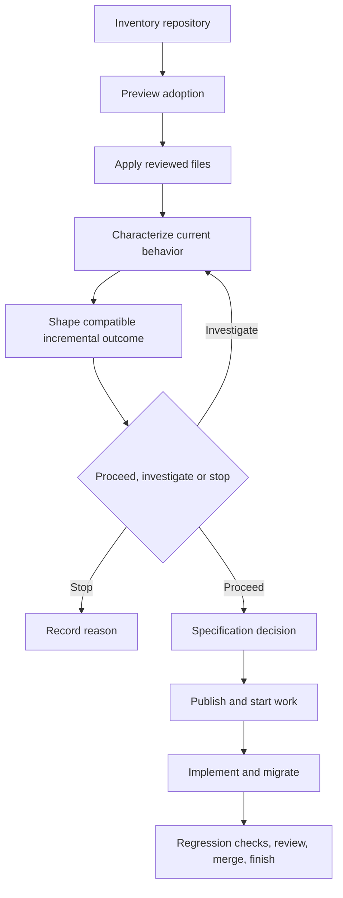

# Brownfield workflow

Use this path when bringing AI-DLC into an existing repository or changing an
existing product. Adoption must preserve application files and observed
behavior while introducing portable workflow controls deliberately.

[Back to the workflow map](../development-workflow.md)

## Flow


```mermaid
flowchart TD
    I[Inventory repository] --> P[Preview adoption]
    P --> A[Apply reviewed files]
    A --> C[Characterize current behavior]
    C --> D[Shape compatible incremental outcome]
    D --> J{Proceed, investigate or stop}
    J -->|Investigate| C
    J -->|Stop| X[Record reason]
    J -->|Proceed| S[Specification decision]
    S --> W[Publish and start work]
    W --> M[Implement and migrate]
    M --> V[Regression checks, review, merge, finish]
```

## 1. Inventory before adopting

Identify the deployable application, manifests and lockfiles, module and data
boundaries, public interfaces, CI rules, operational runbooks, and existing
documentation. Record unknown behavior instead of guessing. Find owner-written
files that overlap AI-DLC managed paths before applying a template.

Establish a clean test baseline. Where important behavior lacks tests, add
characterization tests that describe the current observable contract before
changing it. A characterization test is evidence, not an endorsement of the
current design.

## 2. Preview and apply adoption

Preview first:

```sh
ai-dlc project adopt --root /path/to/project --preset generic
```

Review every proposed file and conflict, then repeat with `--apply`. Existing
managed-path files are conflicts, including user-authored configuration and
documentation. Adoption presets expect existing manifests and lockfiles and do
not create application source. The generic preset installs no language
toolchain.

The bundled template can bootstrap a checkout, but portable updates require an
accessible Git template URL and immutable release tag. Copier owns its answers,
source, revision, and three-way update history; never hand-edit that history to
manufacture upgrade support.

## 3. Establish the managed boundary

After adoption, distinguish four areas:

- application code and owner-authored documents that AI-DLC must preserve;
- template-managed workflow files that can receive reviewed updates;
- provider-owned remote state such as specifications, tracker status, and SCM
  evidence;
- machine-local state such as credentials, paths, caches, and journals.

Snapshot and staging omit `.git`, dependency directories, tool caches,
`.ai-dlc/local/`, and Git-ignored untracked files. Runtime files remain
untouched. If the checkout changes after staging, application aborts and asks
for a fresh preview instead of applying a stale plan. Copier conflicts leave
the original checkout untouched.

<a id="rehearse-a-reviewed-behavior-check"></a>
## 4. Rehearse a reviewed behavior check

Use the team's existing test tools. This procedure demonstrates that one reviewed
check detects one concrete regression; it does not score the suite or select a
universal framework.

1. **Inspect sources.** Read `[setup.steps]`, `[checks.commands]`,
   `checks.required`, `.mise.toml` (including an empty `[tools]` table), test-runner
   configuration, manifests, CI commands and the relevant requirement or acceptance
   source. Record exact paths, the behavior each source establishes and unknowns.
   Do not infer coverage from filenames, a syntax check or successful setup.
2. **Propose and review the mapping.** In the delivery slice, record requirement
   and check IDs, observable behavior, inspected sources, exact team-owned command
   and its source, prerequisites and setup action, required/optional choice,
   unknowns and the maintainer or authorized harness review source. Use existing
   authorization; do not add a second approval ritual. Change shared configuration
   only after this review, preserving authored tests, required IDs and unrelated
   commands.
3. **Prepare the normal runner.** Run the reviewed setup action separately through
   `ai-dlc project setup`; a check never installs its own tools or silently changes
   shell. `mise` is required for `ai-dlc project check` even when the tools table is
   empty. If runtime resolution reports it unavailable, no check ran and no passing
   receipt exists; direct shell execution is diagnostic only, not equivalent
   evidence.
4. **Preflight an external disposable fixture.** Copy the reviewed fixture to an
   explicit temporary location outside the active checkout. Record the source
   revision or tree identity and fixture identity, and retain exact original bytes
   for restoration. Resolve paths before mutation. Stop if the fixture is the
   active checkout or inside it, if isolation is uncertain, or if the exercise
   would use production data or mutate a remote service. Never reset or alter the
   active checkout to manufacture a failure.
5. **Observe pass, regression failure, restored pass.** In the disposable copy,
   run `ai-dlc project check --check CHECK_ID` and require a pass. Introduce only
   the reviewed behavior regression, rerun the same command and require the
   expected failure. Restore the saved bytes, verify the fixture matches its
   recorded baseline, and require a final pass. If the changed behavior still
   passes, or any outcome is unobserved, report the rehearsal as incomplete rather
   than changing the test until it appears successful.
6. **Retain bounded evidence.** Record requirement/check IDs, exact command,
   engine and runtime identity, fixture/source identity, the deliberate change,
   all three outcomes and limitations. This demonstrates detection only for the
   selected behavior. It does not establish complete adequacy, human quality,
   productivity, native-platform qualification or comparison results.

A focused receipt is edit feedback. It retains the full configured required list
and cannot satisfy missing completion outcomes. After target-branch integration,
run `ai-dlc project check --required` for complete required evidence.

## 5. Design the incremental change

Use discovery and the [product brief](../../agents/templates/product-brief.md)
to inspect the existing journey, implementation, tests, consumers and public
interfaces. Separate observed behavior, actual user decisions and hypotheses.
Record sources and their limits: characterization fixtures do not prove live
integration or product value.

Follow the [brownfield example](../../agents/examples/product-shaping/brownfield.md).
State affected users, integrations, compatibility boundaries, migration and
recovery needs. Compare feasible options by impact, confidence, effort and
dependencies, including keeping current behavior when meaningful. Preserve
explicit constraints. Contradictory requirements remain unresolved until the
responsible owner decides; an additive alternative is a proposal, not approval.

Select a bounded outcome and next slice, with stable OUT-001 and RQ-001 IDs owned
by one canonical brief. End with proceed, investigate or stop and reasons.
Investigate material unknowns before an implementation commitment. When proceeding
within existing authorization, keep old-contract regression evidence and plan
rollout/rollback for affected state. Small work can retain the brief alone;
prd-draft can expand rationale while referencing the same IDs. Publication
requires separate authorization.

Use design methods appropriate to the increment; UI exploration is optional.
Follow the [design-to-implementation contract](design-to-implementation.md) when
applicable. Record consequential compatibility decisions in an ADR. Prefer
independently releasable slices where a transition has substantial risk.

## 6. Specify, publish, and implement

Decide whether changed behavior requires a formal specification. Use the
configured provider or a deliberately used local OpenSpec compatibility
fallback when one is required; otherwise record `requires_spec = false` and its
reviewed reason. With tracker and SCM capabilities configured, link the design
and specification from the work record, then publish and start through AI-DLC.
Otherwise, use the local project lifecycle and manual tracking. Implement on
the bound branch when available and preserve unrelated repository behavior.
Add regression tests for old contracts and acceptance tests for new outcomes.

For template updates, run a preview before applying. Sync stages the checkout
in a temporary Git repository and asks Copier to perform the three-way update.
Application files are retained, `.git` metadata is never copied back, ordinary
write errors roll back, and conflicts leave the destination untouched. A
power-loss-safe multi-file transaction is not claimed.

## 7. Review, migrate, and finish

Review compatibility evidence, migrations, rollback, documentation, and the
new behavior—not only the code diff. Always run required checks locally. With
tracker and SCM roles configured, merge through SCM, observe rollout evidence
when configured, and use `ai-dlc work finish <work-id>` to authenticate the
merged revision before completing remote tracker state. Otherwise, close the
manual lifecycle without claiming AI-DLC remote completion.

## Ready and done

Brownfield work is ready when current behavior, compatibility boundaries,
affected owners, incremental design, specification decision, rollback needs,
and test strategy are explicit. Local work is done when required old and new
behavior is verified and migrations and runbooks are current. With tracker and
SCM roles configured, done additionally means the reviewed PR is merged and
AI-DLC accepts every finish gate.
