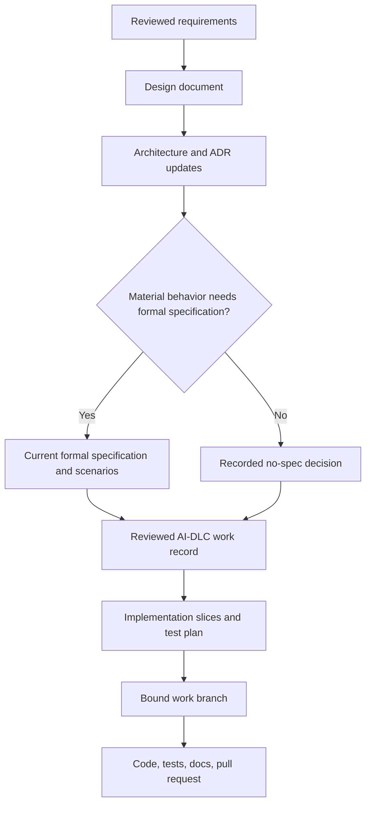

# Design to implementation

This guide defines the evidence passed from product and technical design into
implementation. A design explains intent, journeys, constraints, boundaries,
and decisions. It does not duplicate a PRD, formal specification, tracker, or
implementation diff.

Begin with a shaped outcome: evidence, assumptions, alternatives, and the next
worthwhile increment. UI/UX exploration applies when the increment changes an
interface; API, infrastructure, and migration work use suitable design methods.
Use the [product brief](../../agents/templates/product-brief.md) and
[delivery slice](../../agents/templates/delivery-slice.md) to carry that intent
forward without introducing a second specification system.

[Back to the workflow map](../development-workflow.md)

## The handoff contract

An implementation-ready design answers the following questions or links to the
artifact that does:

| Area | Required evidence |
| --- | --- |
| Identity | Work ID, title, owner, status, and links to tracker and requirements |
| Outcome | Audience, problem, measurable outcome, scope, and explicit non-goals |
| Journey | Entry point, main path, state transitions, permissions, errors, empty/loading states, and accessibility needs |
| System | Deployment and module boundaries, dependency direction, interfaces, data ownership, and failure behavior |
| Decisions | Alternatives considered, selected approach, consequences, and linked ADRs for consequential choices |
| Behavior | Acceptance criteria and links to the current formal specification when required |
| Verification | Acceptance, regression, integration, migration, security, and operational test strategy as applicable |
| Delivery | Incremental slices, compatibility constraints, rollout, observability, recovery, and rollback |
| Traceability | Work record, specification, decisions, branch, pull request, and runbook links as they become available |

The source templates live at `agents/templates/design.md`,
`agents/templates/adr.md`, and `agents/templates/runbook.md`; generated projects
receive them under `docs/templates/`. Update `docs/architecture.md` only when
the durable system view changes.

## Handoff flow

The work record is the traceability bridge. It binds approved scope and remote
artifacts before implementation mutates the tracker or creates branch state.
It should link durable sources rather than paste their contents.

## From requirements to finishable work

Use spec-from-prd with a reviewed canonical brief or PRD. Keep OUT/RQ IDs owned
by that source; link requirement → formal scenario (when required) → deliverable
work ID → implementation step → observed verification. Product rationale belongs
in the brief/design, behavior with the selected specification provider, delivery
status in work/tracker, and implementation steps inside the work item.

One behavior ticket owns one independently finishable OpenSpec change. A parent
epic coordinates children without one shared specification gate. Tests, parser,
docs and refactoring checkboxes are steps, not automatic extra tickets. A
verification-only item records `requires_spec=false` and its reviewed reason,
references existing behavior and retains all applicable completion gates.

See [localized export](../../agents/examples/delivery-slices/localized-export.md)
and [compatibility rehearsal](../../agents/examples/delivery-slices/compatibility-rehearsal.md).
These synthetic examples propose local IDs and document destinations; they do
not install records, create remote work or establish actual approval/live results.

Work records accept optional `requirements` and `depends_on` lists, defaulting to
empty for older work. Requirements are nonblank single-token IDs, not copied spec
prose or paths automatically interpreted as source documents. Put canonical source,
plan, specification and evidence references in `artifacts`. Dependencies name local
work IDs in `.ai-dlc/work/`; preserve their pinned providers and binding identity.

Run `ai-dlc work validate WORK_ID --root .` before publication. It returns valid
(exit 0) or invalid (exit 1), reads only the selected dependency closure, and
initializes no mutation journal. Missing/unsafe IDs, self/cycles, invalid records,
binding drift and missing local artifact files/directories fail before publish
or start effects. Unrelated drafts do not block the selected work. Local artifact
paths must remain in the repository without symlinks. Fragments are retained as
references without interpreting specification text. HTTP(S) references are not
probed, and tracker/PR/branch/deployment/knowledge references remain provider-owned.

Validation does not approve scope or prove completion. `work start` freshly reads
every reachable dependency through its pinned tracker and requires canonical
`closed`. Cancelled, duplicate, incomplete, unpublished or unavailable statuses
block before branch creation, work saves or tracker changes. Resolve missing
interfaces/status with their owners; prepare independent local drafts meanwhile.

First issue creation includes scope, requirement/dependency references, artifacts,
specification decision and acceptance. Re-publication reconciles the existing
mapping/correlation without overwriting authored descriptions or changing prior
journal identities. It does not publish updated scope into an existing issue.
Keep unresolved product semantics and unperformed live checks visible. Review,
merge, exact-revision evidence and `ai-dlc work finish` remain the completion path.

## Greenfield handoff

For a new application, design begins with the first deployable boundary and
one end-to-end user outcome. Define the minimum architecture needed for that
slice, then identify which interfaces are intentionally stable and which are
still internal. Avoid designing hypothetical services, extension systems, or
configuration until a requirement needs them.

The first slice must leave a reproducible setup, lockfile, baseline checks, and
one observable behavior. Its tests prove both the language/toolchain baseline
and the user outcome.

## Brownfield handoff

For an existing application, design begins with evidence about current
behavior. List affected interfaces, callers, data, operational procedures, and
compatibility promises. Characterization tests protect important existing
contracts. The design states how each slice moves from the current state to the
target state and how to recover if the transition fails.

Do not use a broad rewrite as the handoff unit when an incremental change can
be reviewed, verified, and rolled back independently.

## Implementation expectations

Before coding, an implementer should be able to map each acceptance criterion
or required scenario to a planned slice and verification method. During
implementation:

- work only on the bound branch and within reviewed scope;
- use tests to drive new behavior and reproduce bugs;
- preserve unrelated user changes and existing contracts;
- update design, decisions, architecture, and runbooks when code invalidates
  them;
- make uncertainty visible instead of inventing product behavior;
- run required project checks before review.

The pull request should explain the outcome, design decisions, compatibility
or migration effects, and evidence. Review compares implementation with the
linked design and specification. `ai-dlc work finish <work-id>` then verifies
the merged revision and remote evidence; it does not infer success from the
local branch.

## Change control

If implementation reveals a material product, interface, security, migration,
or operational decision that the design does not answer, pause and update the
reviewed artifact before continuing. Small implementation details may remain
in code and tests. Decisions that future maintainers must understand belong in
the repository.
