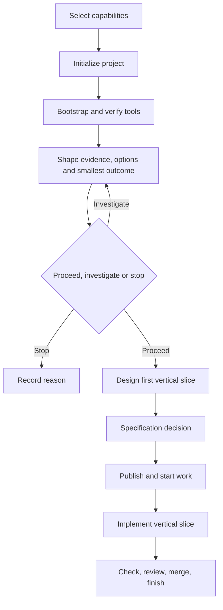

# Greenfield workflow

Use this path when creating a new deployable application rather than adopting
an existing repository. The goal is a small, working vertical slice with clear
ownership and repeatable checks—not a speculative platform.

[Back to the workflow map](../development-workflow.md)

## Flow



## 1. Select the project boundary and capabilities

Start with one deployable application and explicit module responsibilities.
Split deployment only when requirements justify independent operational
ownership. Select only the provider roles the project needs: specification,
tracker, knowledge, SCM, deployment evidence, and agent clients.

Record the initial runtime, storage, external dependencies, public interfaces,
and operational owner in `docs/architecture.md`. Portable configuration may
name required environment variables, but machine scope and the process
environment own account selection, machine-specific paths, and actual secret
values.

## 2. Initialize and bootstrap

Create the project with the relevant language preset:

```sh
ai-dlc project init my-project --preset python --apply
```

Generic, Python/uv, Node, and Rust presets include durable documentation and
shared agent instructions. Initialized language projects contain a minimal
dependency-free application. First setup creates the language lockfile; later
setup uses that lock without updating it. Every preset checks generated agent
files, and initialized language projects also run a real syntax or compiler
check.

Run the reviewed bootstrap, then:

```sh
ai-dlc project setup
ai-dlc project check --required
```

Do not add feature work until the empty project can be recreated and its
baseline checks pass.

## 3. Establish product and design context

Use discovery and the [product brief](../../agents/templates/product-brief.md)
to establish audience, problem, observed evidence, actual user decisions and
hypotheses. A requested dashboard or feature is a candidate solution, not proof
of value. Compare at least two feasible approaches and doing nothing when
meaningful, considering impact, evidence confidence, effort and dependencies.
Select the smallest useful outcome; use a bounded investigation when the value
or material constraints remain unknown.

Follow the [greenfield example](../../agents/examples/product-shaping/greenfield.md).
Keep one canonical brief with stable OUT-001 and RQ-001 identifiers. Record scope,
exclusions, success evidence and unresolved decisions. End with proceed,
investigate or stop and reasons; the recommendation does not invent approval.
Small work can use this brief alone. Use prd-draft only when additional product
rationale is useful, preserving the same IDs and evidence links.

Proceed into design/specification only within existing authorization and resolved
material constraints. Design methods fit the change: interaction states and
accessibility for UI, contracts or operational checks for non-UI work. Document
consequential architecture choices under `docs/decisions/` and follow the
[design-to-implementation contract](design-to-implementation.md) when applicable.
Discovery does not itself publish tracker work.

## 4. Decide on formal specification

Use the specification decision skill after requirements and design are
reviewed. When formal behavior is required, translate approved outcomes and
scenarios through the configured specification provider or a deliberately used
local OpenSpec compatibility fallback. When no specification is required,
record `requires_spec = false` and its reviewed reason. The specification is
authoritative for behavior; the design remains authoritative for rationale and
interaction context.

## 5. Publish, start, and implement

When tracker and SCM capabilities are configured, prepare and review
`.ai-dlc/work/<id>.toml`, then publish it. Publication creates or reuses the
tracker item. Starting the work binds its branch and transitions the remote
lifecycle state. Without both roles, continue with local project checks and a
manual lifecycle until the missing role is configured.

Implement the smallest end-to-end slice that demonstrates the outcome. Add
acceptance tests and extend `checks.required` as real application behavior is
introduced. Keep architecture, design, decisions, migrations, and runbooks in
the same change when the code makes them stale.

## 6. Review, merge, and finish

Always run required checks locally and review the change against the design and
any required formal specification. When tracker and SCM roles are configured,
merge through SCM and use `ai-dlc work finish <work-id>`; it authenticates the
merged revision and validates configured CI and deployment evidence before
completing the tracker item. Otherwise, close the project's manual lifecycle
without claiming AI-DLC remote completion.

## Ready and done

The first implementation is ready when its user, outcome, scope, design,
specification decision, and test strategy are explicit; a work record is also
required for the configured remote lifecycle. Local work is done when the
vertical slice works, required checks pass, and durable documents match the
implementation. With tracker and SCM roles configured, done additionally means
the reviewed PR is merged and AI-DLC accepts the finish gates.
