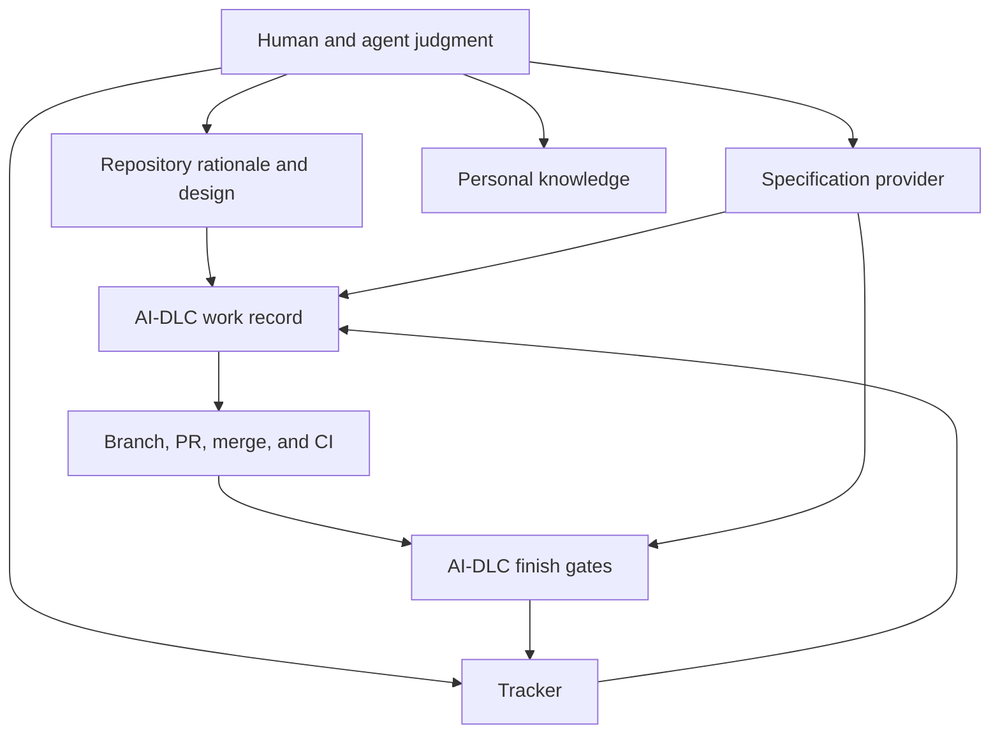

# Workflow tool map

The lifecycle uses stable roles; `ai-dlc.toml` selects their current providers.
This page records how the default AI-DLC toolset participates without making a
vendor part of the lifecycle definition.

Installed tool use, harness guidance, and provider adapters are complementary.
Agents can use native tools directly; the configured services provide specific
validation and completion boundaries. The [roadmap](../roadmap.md) distinguishes
planned component/workflow support from the current interfaces listed here.

[Back to the workflow map](../development-workflow.md)

## Role to provider mapping

| Stable responsibility | AI-DLC role or service | Current default | Owns |
| --- | --- | --- | --- |
| Formal behavior | `specs` | OpenSpec | Requirements and scenarios |
| Priority and lifecycle | `tracker` | Linear | Work identity, priority, and status |
| Personal continuity | `knowledge` | Obsidian | Private notes, reflection, and links |
| Review, merge, and CI identity | `scm` | GitHub | Branches, pull requests, merged SHA, workflow runs, and artifacts |
| Deployment evidence | `deploy` | None by default | Environment-specific release evidence when configured |
| Interactive agent | `agent-client` | Claude Code and Codex | Analysis, judgment, authoring, and tool use under user authorization |
| Deterministic workflow | AI-DLC CLI and selected MCP services | Local Python implementation | CLI: validation, rendering, machine bindings, reconciliation, receipts, and gates; MCP: reviewed work, doctor, and knowledge only |
| Project generation and updates | Template service | Copier | Template answers, source revision, preview, and three-way updates |

Projects may omit roles they do not need. Confirm the actual mapping in the
project's `ai-dlc.toml`; do not infer an account, workspace, repository, or
environment from these defaults.

The complete evidence-gated work cycle currently requires configured tracker
and SCM roles. The runtime retains compatibility fallbacks for local OpenSpec
and GitHub, but they do not choose account, repository, or authorization.
GitHub uses conventional `verify.yml` and `main` defaults unless overridden;
the tracker has no fallback. Without a configured tracker or SCM role, project
initialization, adoption, setup, checks, design, and documentation remain
available, but publish/start/status/finish is not a usable end-to-end lifecycle.
A missing specification role may deliberately use local OpenSpec when its
artifacts exist; otherwise the work must be reviewed with
`requires_spec = false`. Knowledge, deployment, and agent clients remain
optional.

## Skill map

| Moment | Skill | Expected judgment output |
| --- | --- | --- |
| Start of work | `day-start` | Reconciled priority, bindings, branch, and evidence |
| Unclear problem | `discovery` | Bounded problem, evidence, assumptions, questions, and next investigation |
| Durable product rationale | `prd-draft` | Reviewed problem, outcomes, scope, constraints, risks, and acceptance |
| Specification decision | `needs-spec` | Explicit decision based on behavior and risk |
| Approved behavior | `spec-from-prd` | Provider-owned requirements and scenarios linked to rationale |
| Incoming idea or note | `review-inbox` | Classification and next action without automatic publication |
| Session or ownership transfer | `handoff` | Verified state, decisions, evidence, risks, and next action |
| End of work period | `day-end` | Concise continuity record and reconciled remote state |

Skills provide judgment patterns. Provider instructions define vendor
operations. AI-DLC services own validation and mutation boundaries. A skill
cannot bypass completion gates or expand the user's authorization.

## Portable enrollment boundary

A private profile repository owns the portable `ai-dlc-profile.toml` and is
enrolled by pinned revision. A second machine enrolls that same revision but
maintains its own machine binding for paths, account selection, and
environment-variable names. The project repository owns shared policy; an
external password manager, keychain, or secret injector owns credential values
and supplies them transiently through the process environment. Codex and Claude
own their generated client configuration. Never commit `.env` files or
credential values.

`ai-dlc machine status`, `plan`, `apply`, `sync`, and `doctor` own the local
enrollment lifecycle. Local CLI and MCP execution are current; hosted or cloud
execution is a later qualification target. Obsidian create/attach and provider
discovery are next-cycle gaps rather than current provider capabilities.

Machine enrollment mutations are CLI-only in this cycle. MCP exposes exactly
`work_publish`, `work_start`, `work_status`, `work_link`, `work_finish`,
`doctor`, `knowledge_find`, `knowledge_append`, and `knowledge_note`; it does
not expose machine enrollment mutation. These MCP identifiers differ from the
space-separated CLI commands, such as `ai-dlc work publish` and `ai-dlc
knowledge append`.

## Command and service map

| Area | Interfaces | Effect |
| --- | --- | --- |
| Readiness and context | `ai-dlc doctor`, `ai-dlc context` | Checks the selected environment and summarizes work/check context |
| Project creation | `ai-dlc project init`, `ai-dlc project adopt` | Initializes a project or previews/applies conflict-safe adoption |
| Project maintenance | `ai-dlc project sync`, `ai-dlc project rebind` | Performs staged Copier updates or previews/applies reviewed provider rebinding |
| Project execution | `ai-dlc project setup`, `ai-dlc project check --required` | Runs declared setup and checks and emits verification receipts |
| Agent configuration | `ai-dlc agents render` | Previews, applies, or verifies owned project/personal client configuration |
| Work lifecycle | `ai-dlc work publish`, `ai-dlc work start`, `ai-dlc work status`, `ai-dlc work finish` | Reconciles tracker state, binds work to a branch, and enforces completion gates |
| Traceability | `ai-dlc work link` | Links PR, specification, branch, deployment, or tracker evidence to reviewed work |
| Provider inspection and connection | `ai-dlc provider list`, `ai-dlc provider test`, `ai-dlc provider connect` | Discovers adapters, runs isolated contract or authorized live checks, and previews/applies an explicitly reviewed provider connection |
| Personal knowledge | `ai-dlc knowledge find`, `ai-dlc knowledge note`, `ai-dlc knowledge append` | Reads or writes explicitly selected vault material |
| Configuration profiles | `ai-dlc profile show`, `ai-dlc profile migrate`, `ai-dlc profile capture` | Resolves provenance, previews schema migration, or captures supported preferences |
| Machine provisioning | `ai-dlc setup plan`, `ai-dlc setup apply` | Previews or applies selected workstation modules and personal agent configuration |
| Agent-native access | `ai-dlc mcp serve` | Exposes reviewed work, read-only doctor, and selected knowledge services through local MCP; machine enrollment mutation remains CLI-only |
| Legacy compatibility | `ai-dlc scaffold` | Preserves the retired Rust-era provider scaffolding interface |

## Artifact ownership

- Repository: architecture, PRDs, design context, ADRs, runbooks, code, tests.
- Specification provider: formal behavior and scenarios.
- Tracker: priority, work identity, lifecycle state.
- SCM/CI: review, merge identity, test artifacts, and receipts.
- Knowledge provider: private continuity and links to durable artifacts.
- Portable project configuration: provider roles and names of required
  environment variables, never their values.
- Local machine scope: account choices, paths, caches, journals, and ignored
  non-secret control-plane IDs and metadata.
- External password manager, keychain, or secret injector: actual credential
  values, supplied transiently through the process environment.

## CI and release evidence

The generated GitHub workflow runs reviewed bootstrap artifacts and required
checks, then uploads a receipt. Single-job projects use `ai-dlc-receipt`.
Matrix repositories list every exact expected artifact in
`scm.receipt_artifacts`; finish reads this declaration from the authenticated
merged revision and validates every receipt.

Until a signed and pinned AI-DLC release exists, projects must supply the
published `bootstrap/release.sh` and corresponding artifact manifest instead
of inventing an unpinned download URL. Release gates must cover clean-machine
bootstrap and artifact integrity.

Skill publication has a separate behavioral gate: run no-guidance control and
skill-enabled scenarios from `agents/evaluation.toml`, preserve transcripts,
and record human scoring. Packaging a skill is not evidence that it changes
agent behavior correctly.

## Evolving the toolset

When replacing or adding a tool:

1. Keep the lifecycle stage and responsibility stable where possible.
2. Update `ai-dlc.toml`, provider contracts, and machine credential references.
3. Describe the new provider here and remove claims that no longer apply.
4. Update relevant skills only when the judgment pattern changes.
5. Rebind existing work through reviewed mappings; provider changes apply to
   new work by default.
6. Add deterministic contract and integration tests plus an explicit live
   walkthrough for externally mutating providers.
7. Update diagrams and project templates in the same reviewed change.

Never place secret values, account identifiers, or machine-local paths in this
map. Naming a required environment variable in portable configuration is safe;
storing its value there is not.
