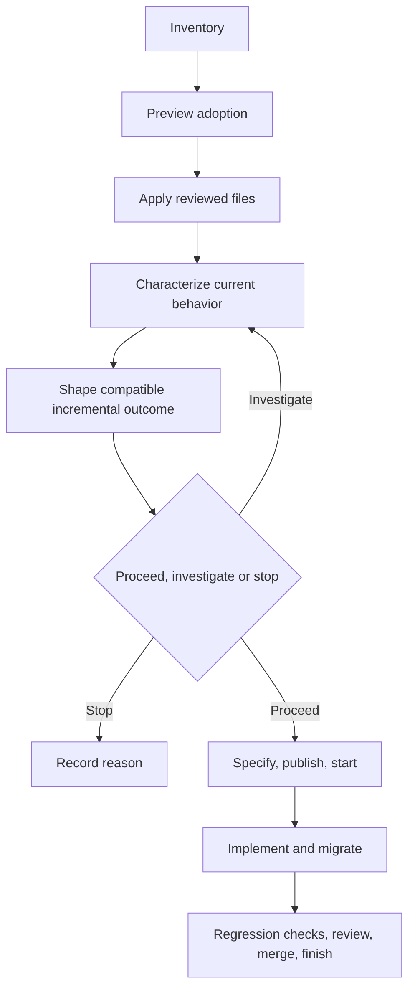

# Brownfield workflow

Use this path when adopting AI-DLC into an existing repository or changing an
existing product. Preserve application files and observed behavior while
introducing workflow controls deliberately.

[Back to the workflow map](../development-workflow.md)

1. Inventory manifests, lockfiles, boundaries, interfaces, CI, runbooks,
   existing documentation, and owner-written files on managed paths.
2. Establish a clean baseline and add characterization tests for important
   behavior that is not already protected.
3. Preview with `ai-dlc project adopt --root /path/to/project --preset generic`.
   Apply only after reviewing every proposed file and conflict. Adoption never
   creates application source for an existing project.
4. Separate application-owned, template-managed, provider-owned, and
   machine-local state. Keep credentials and caches out of portable files.
5. Use discovery and the [product brief](../templates/product-brief.md) to inspect
   behavior, tests and consumers. Separate evidence, actual decisions and hypotheses.
   Follow the [brownfield example](../examples/product-shaping/brownfield.md).
   Compare options, including keeping current behavior, by impact, confidence,
   effort and dependencies. State compatibility, migration, rollout and recovery.
   Keep stable OUT-001/RQ-001 IDs in one canonical brief and end with proceed,
   investigate or stop plus reasons. Resolve contradictions with their owner;
   an additive alternative is a proposal until decided. Preserve default contracts.
   Proceed within existing authorization when material constraints are resolved;
   otherwise bound the investigation. UI and a larger PRD are optional. Fixture
   success is not live qualification. Discovery does not authorize publication.
6. Map a concrete requirement to a reviewed team-owned check and follow
   [Rehearse a reviewed behavior check](#rehearse-a-reviewed-behavior-check).
7. Record the specification decision. Use the configured provider or local
   OpenSpec compatibility fallback when formal behavior is required; otherwise
   record `requires_spec = false` and its reviewed reason.
8. With tracker and SCM configured, publish and start reviewed work, merge
   through SCM, and use `ai-dlc work finish <work-id>` after review. Otherwise,
   use local checks and manual tracking without claiming AI-DLC remote
   completion. In either path, protect the change with regression and
   acceptance tests.

## Rehearse a reviewed behavior check

Use the team's existing test tools. This procedure demonstrates that one reviewed
check detects one concrete regression; it does not score the suite or select a
universal framework.

1. **Inspect sources.** Read `[setup.steps]`, `[checks.commands]`,
   `checks.required`, `.mise.toml` (including an empty `[tools]` table), test-runner
   configuration, manifests, CI commands and the relevant requirement or acceptance
   source. Record exact paths, the behavior each source establishes and unknowns.
   Do not infer coverage from filenames, a syntax check or successful setup.
2. **Propose and review the mapping.** In the delivery slice, record requirement
   and check IDs, observable behavior, inspected sources, exact team-owned command
   and its source, prerequisites and setup action, required/optional choice,
   unknowns and the maintainer or authorized harness review source. Use existing
   authorization; do not add a second approval ritual. Change shared configuration
   only after this review, preserving authored tests, required IDs and unrelated
   commands.
3. **Prepare the normal runner.** Run the reviewed setup action separately through
   `ai-dlc project setup`; a check never installs its own tools or silently changes
   shell. `mise` is required for `ai-dlc project check` even when the tools table is
   empty. If runtime resolution reports it unavailable, no check ran and no passing
   receipt exists; direct shell execution is diagnostic only, not equivalent
   evidence.
4. **Preflight an external disposable fixture.** Copy the reviewed fixture to an
   explicit temporary location outside the active checkout. Record the source
   revision or tree identity and fixture identity, and retain exact original bytes
   for restoration. Resolve paths before mutation. Stop if the fixture is the
   active checkout or inside it, if isolation is uncertain, or if the exercise
   would use production data or mutate a remote service. Never reset or alter the
   active checkout to manufacture a failure.
5. **Observe pass, regression failure, restored pass.** In the disposable copy,
   run `ai-dlc project check --check CHECK_ID` and require a pass. Introduce only
   the reviewed behavior regression, rerun the same command and require the
   expected failure. Restore the saved bytes, verify the fixture matches its
   recorded baseline, and require a final pass. If the changed behavior still
   passes, or any outcome is unobserved, report the rehearsal as incomplete rather
   than changing the test until it appears successful.
6. **Retain bounded evidence.** Record requirement/check IDs, exact command,
   engine and runtime identity, fixture/source identity, the deliberate change,
   all three outcomes and limitations. This demonstrates detection only for the
   selected behavior. It does not establish complete adequacy, human quality,
   productivity, native-platform qualification or comparison results.

A focused receipt is edit feedback. It retains the full configured required list
and cannot satisfy missing completion outcomes. After target-branch integration,
run `ai-dlc project check --required` for complete required evidence.

Copier updates use a staged three-way merge. Conflicts or a concurrently changed
checkout leave the destination untouched and require a fresh preview. Runtime,
Git, dependency, ignored, and `.ai-dlc/local/` files are not copied through the
staging area.

Local work is done when required old and new behavior is verified and
migrations and runbooks are current. With tracker and SCM configured, done
additionally means the reviewed PR is merged and AI-DLC accepts every finish
gate.
