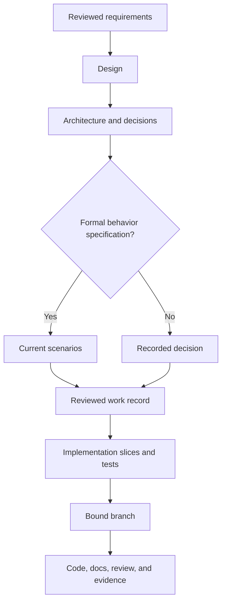

# Design to implementation

A design explains intent, journeys, constraints, system boundaries, and
decisions. It links to requirements and formal specifications without copying
them. Implementation is ready when the following evidence is present or
explicitly judged unnecessary.

Begin with evidence, assumptions, alternatives, and a shaped product outcome.
New products need a smallest useful slice; existing products need observed behavior
and compatibility boundaries. Apply UI/UX exploration only where relevant and
scale documentation and evaluation to the change's scope and risk.

[Back to the workflow map](../development-workflow.md)

| Area | Evidence |
| --- | --- |
| Identity | Work ID, title, owner, status, tracker, and requirements links |
| Outcome | Audience, problem, measurable outcome, scope, and non-goals |
| Journey | Entry point, main path, states, permissions, errors, empty/loading states, and accessibility |
| System | Deployment and module boundaries, interfaces, data ownership, dependencies, and failure behavior |
| Decisions | Alternatives, selected approach, consequences, and linked ADRs |
| Behavior | Acceptance criteria and current formal specification when required |
| Verification | Acceptance, regression, integration, migration, security, and operational tests as applicable |
| Delivery | Incremental slices, compatibility, rollout, observability, recovery, and rollback |
| Traceability | Work record, decisions, specification, branch, PR, and runbooks |

For greenfield work, center the handoff on one deployable boundary and vertical
slice. For brownfield work, begin with current behavior, callers, data,
compatibility promises, characterization tests, and an incremental transition.

If implementation uncovers a material product, interface, security, migration,
or operational choice that the design does not answer, pause and update the
reviewed artifact. Small implementation details may remain in code and tests;
decisions future maintainers need belong in repository documentation.

For projects with tracker and SCM roles, link the reviewed design to the work
record before publication and use `ai-dlc work finish <work-id>` after merge.
Without those roles, keep the same design evidence and test discipline but use
the project's manual lifecycle until the roles are configured.

## From requirements to finishable work

Use spec-from-prd with a reviewed canonical brief or PRD. Keep OUT/RQ IDs owned
by that source; link requirement → formal scenario (when required) → deliverable
work ID → implementation step → observed verification. Product rationale belongs
in the brief/design, behavior with the selected specification provider, delivery
status in work/tracker, and implementation steps inside the work item.

One behavior ticket owns one independently finishable OpenSpec change. A parent
epic coordinates children without one shared specification gate. Tests, parser,
docs and refactoring checkboxes are steps, not automatic extra tickets. A
verification-only item records `requires_spec=false` and its reviewed reason,
references existing behavior and retains all applicable completion gates.

See [localized export](../examples/delivery-slices/localized-export.md)
and [compatibility rehearsal](../examples/delivery-slices/compatibility-rehearsal.md).
These synthetic examples propose local IDs and document destinations; they do
not install records, create remote work or establish actual approval/live results.

Work records accept optional `requirements` and `depends_on` lists, defaulting to
empty for older work. Requirements are nonblank single-token IDs, not copied spec
prose or paths automatically interpreted as source documents. Put canonical source,
plan, specification and evidence references in `artifacts`. Dependencies name local
work IDs in `.ai-dlc/work/`; preserve their pinned providers and binding identity.

Run `ai-dlc work validate WORK_ID --root .` before publication. It returns valid
(exit 0) or invalid (exit 1), reads only the selected dependency closure, and
initializes no mutation journal. Missing/unsafe IDs, self/cycles, invalid records,
binding drift and missing local artifact files/directories fail before publish
or start effects. Unrelated drafts do not block the selected work. Local artifact
paths must remain in the repository without symlinks. Fragments are retained as
references without interpreting specification text. HTTP(S) references are not
probed, and tracker/PR/branch/deployment/knowledge references remain provider-owned.

Validation does not approve scope or prove completion. `work start` freshly reads
every reachable dependency through its pinned tracker and requires canonical
`closed`. Cancelled, duplicate, incomplete, unpublished or unavailable statuses
block before branch creation, work saves or tracker changes. Resolve missing
interfaces/status with their owners; prepare independent local drafts meanwhile.

First issue creation includes scope, requirement/dependency references, artifacts,
specification decision and acceptance. Re-publication reconciles the existing
mapping/correlation without overwriting authored descriptions or changing prior
journal identities. It does not publish updated scope into an existing issue.
Keep unresolved product semantics and unperformed live checks visible. Review,
merge, exact-revision evidence and `ai-dlc work finish` remain the completion path.
